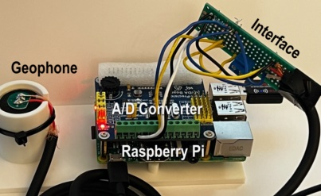

# Seismo: a DIY seismic station

A single-channel, sensitivity-first seismometer in a garage in Oakmont, Santa Rosa,
California, on the Rodgers Creek / Maacama fault system. Recording continuously since
2026-07-20 as station **SS.OAKM1.00.EHZ**. Live at **https://seismo.mcguinness.ai**.

It started with a chandelier at home that I noticed would swing when the ground shook, and wondering if it would make a good improvised seismometer. It didn't.  But I progressed to a Raspberry Pi, a 24-bit ADC and a 4.5 Hz geophone that could.  Here's a first prototype; the final version is essentially the same, just done a lot neater:

Does it work? Does it work well? To answer that, its findings are checked against a USGS National Strong Motion Project accelerometer 1.64 km away, and after one empirical sensitivity factor the two agree well enough to validate the system.

## The system in three boxes

1. **The station** (Raspberry Pi 2B, garage): geophone, ADS1256 digitizer, miniSEED day-files at 100 sps, timed from a GPS stratum-1 clock on the LAN. It does nothing but acquire; a busy Pi is a noisy Pi.
2. **The data engine** (Raspberry Pi 5, on the house LAN): the owned archive, re-detection, a gradient-boosting classifier that scores every trigger, a JSON API.
3. **The public website** (cloud VPS): the dashboard, fed outbound-only from the house.

## Read on

- [The story](readme/story.md): why, how, and what a hobbyist can and cannot claim.
- [Architecture](readme/architecture.md): the three hosts, why they are three, and how this differs from a Raspberry Shake.
- [Reproducing the results](readme/reproducing.md): the comparison against NP.1835, the detection-range fit, and retraining the trigger classifier.
- [Catches](https://seismo.mcguinness.ai/catches): every confirmed earthquake beside the professional station's record, on the same axes.

## Navigating the repo

`STATUS.md` is the running log, newest first, with the current-system summary at the
top; `STATUS-ARCHIVE.md` holds everything before 2026-08-20. `BACKLOG.md` is deferred
work. `specification.md` is the original design and the alternatives rejected.
`CLAUDE.md` is the working brief for the AI side of the collaboration and doubles as the
best map of where the code runs.

MIT licensed. Not a professional instrument; treat every number here as a hobbyist's,
checked against a professional station where it could be.
