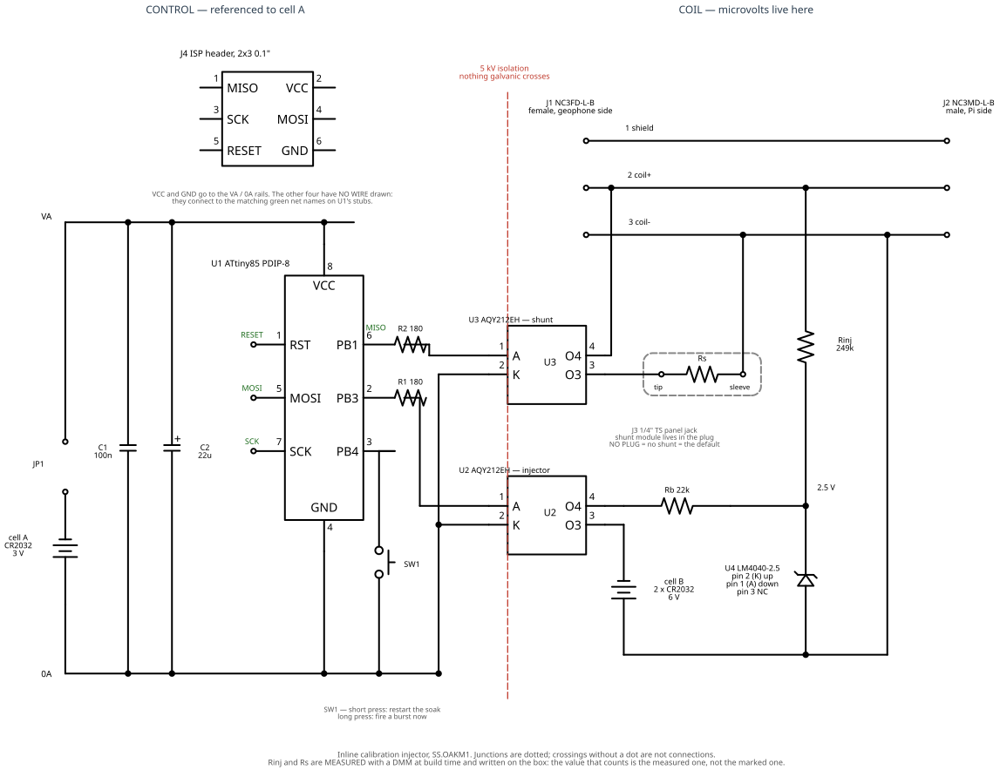
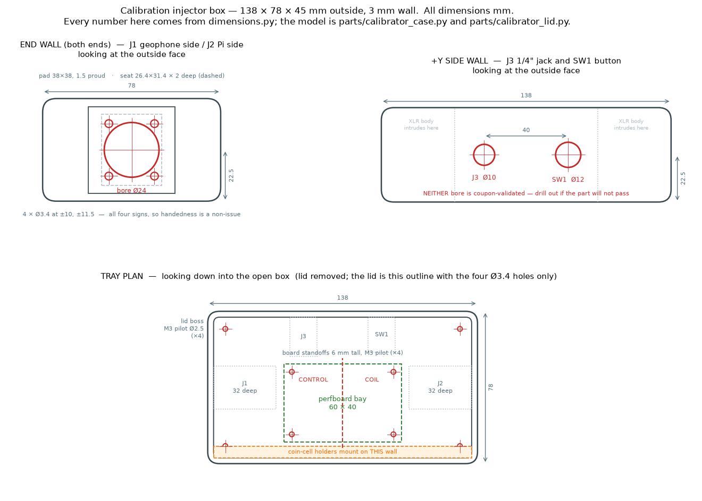

# Building the calibration injector

The parts list and every *why* behind this box are in [`BOM-calibrator.md`](BOM-calibrator.md).
This file is the other half: the **schematic**, the **board layout**, and the **order to
solder it in**. Read the BOM first if you want to know why there is an LM4040 in a box
that could have been a 555 and a resistor.

The firmware is `calibrator/`, the burst finder is `analysis/calfinder.py`, and the fit
is `analysis/ringdown.py`. **The point of the whole thing:** `f0` and `zeta` in
`station/SS.OAKM1.xml` are currently a nameplate number and a vendor spec — guesses —
and every magnitude this station has ever published rests on them.

---

## The schematic



Source: [`calibrator_schematic.py`](calibrator_schematic.py) (schemdraw). Re-render with

    direnv exec . python doc/calibrator_schematic.py

Same arrangement as [`rev2_frontend_schematic.py`](rev2_frontend_schematic.py): the
drawing is generated, so it cannot drift from the description the way a hand-drawn image
does. Junctions are dotted; two lines crossing without a dot are not connected.

### What the drawing is actually saying

**The dashed red line is the whole design.** Left of it: a microcontroller, a coin cell,
a button. Right of it: a 375 Ω coil whose interesting signals are around a microvolt, on
a station whose quiet-night floor is 0.8 µV RMS in 1–15 Hz. The only parts that cross are
the two PhotoMOS packages, and they cross with 5 kV of isolation and no galvanic path.

Everything else follows from keeping those two worlds apart:

- **Pin 1 (shield) runs connector to connector and nothing in the box touches it.** That
  is what keeps "shield grounded solely at the Pi" (`BOM-geophone-case.md`) true after
  splicing a box into the middle of the run.
- **Cell B floats.** Its negative terminal is tied to coil− and to nothing else; the
  LM4040's anode joins it there. There is no reference to cell A anywhere on that side.
- **The injector is gated upstream of the bias resistor.** Off, the whole island draws
  nothing. Left ungated, the LM4040's ~160 µA would flatten a 220 mAh cell in about
  eight weeks — `220 / 0.160 = 1375 h`.
- **The shunt PhotoMOS is on the coil side of the jack**, so with the shunt open, J3 and
  whatever is plugged into it are disconnected from the coil rather than hanging across
  it. A single SPST can only isolate one leg; the sleeve stays a stub, so keep that run
  short on the board.

### Two things settled while drawing it

**1. "Injector mid-cable vs. shunt at the board end" is not a conflict.**
`BOM-calibrator.md` left this open, citing `rev2-frontend.md:233` ("keep the shunt at the
BOARD end"). That line gives its own reason and its own number: cable resistance, "a few
metres adds well under an ohm against 385 Ω". This box sits at the **Pi end** with a
0.5–1 m cable to the board, so the extra series resistance in the shunt path is a
fraction of an ohm against `Rc + Rs` of 375 Ω upward — under 0.3 % of ζ, against a fit
that carries a −0.066 systematic residual at ζ = 0.85. **It is the board end for every
purpose that matters.** Closed.

**2. The 249 kΩ + LM4040 path sits across the coil permanently, and that is fine.**
When U2 is open, there is still a DC path coil+ → Rinj → LM4040 → cell B− → coil−. In
parallel with a 375 Ω coil, 249 kΩ costs 0.15 % of signal. Its Johnson noise is
64 nV/√Hz across 249 kΩ = 0.26 pA/√Hz of noise current, which in 375 Ω is
**0.1 nV/√Hz** — four orders of magnitude under the 0.8 µV RMS floor. Not a problem, and
now it is a number rather than a hope.

**But note what this does to bring-up stage 1.** `BOM-calibrator.md` says stage 1
(populated, batteries OUT) "exercises the PhotoMOS off-state leakage and output
capacitance in series with the 249 kΩ". With cell B removed, that chain is open at the
holder, so stage 1 exercises it only as dead copper. What stage 1 *does* genuinely test:
board stray capacitance to the signal pair, the layout, every joint and ferrule, and the
**shunt** PhotoMOS's off state, which is directly across the coil and needs no battery.
The injection leg's steady state is tested by **stage 2**, not stage 1. Both stages still
earn their place; the claim just needed narrowing.

---

## The LED resistor the BOM got wrong

**I changed R1/R2 from 330 Ω to 180 Ω. Veto it if you disagree — here is the arithmetic.**

The relevant specs, both read off the datasheets today rather than recalled:

| | |
|---|---|
| ATtiny85 `V_OH` | **min 2.5 V** at `I_OH = −5 mA`, `V_CC = 3 V` (Table 21-1) |
| AQY212EH `V_F` | 1.14 V at 5 mA |
| AQY212EH LED operate current | typ 1.2 mA, **max 3.0 mA** — i.e. turn-on is only *guaranteed* up to 3.0 mA |
| AQY212EH recommended `I_F` | 5–10 mA |

With **330 Ω** and a worst-case part on a fresh 3.0 V cell:
`I = (2.5 − 1.14) / 330 = 4.1 mA`. Fine — 1.4× over the guaranteed-operate current.

With **330 Ω** near end of cell life, say a 2.7 V cell sagging to ~2.5 V under load, so
`V_OH ≈ 2.0 V`: `I = (2.0 − 1.14) / 330 = 2.6 mA`. That is **below the 3.0 mA at which
turn-on is guaranteed.** The failure mode is a box that quietly stops calibrating as its
cell ages, which is exactly the failure a calibration monitor must not have.

With **180 Ω**: `(2.5 − 1.14) / 180 ≈ 6.4 mA` worst-case fresh (inside the recommended
5–10 mA band), and `(2.0 − 1.14) / 180 = 4.8 mA` at end of life — still 1.6× the
guaranteed-operate current.

**And it costs almost nothing, because the watchdog dominates the budget:**

| | per year |
|---|---|
| sleep, power-down + WDT — datasheet **max 10 µA**, typically ~4 µA | 35–88 mAh |
| bursts at 6.5 mA: 3.0 s injector + 4.5 s shunt per pair, 4 pairs/day | **20 mAh** |
| **total** | **55 mAh typ, 108 mAh worst** |

A CR2032 is ~220 mAh, so **~4 years typical, ~2 years worst case**. Going from 330 Ω to
180 Ω moves the total by about 6 mAh/year. The BOM's "~5 years" was optimistic mostly
because it assumed 5 µA of sleep; the datasheet's worst case is 10 µA.

**What the 22 µF actually does — and does not do.** The BOM says it "holds the rail
through the 5 mA LED pulse". It cannot: a 500 ms pulse at 6.5 mA is 3.3 mC, and 22 µF at
3 V holds 66 µC — 50× short. The cap smooths the *edges*; the **cell** supplies the
pulse, through its own ESR. So cell A's useful life is set by rising ESR, not by
capacity, and the worst-case load is the **shunted** burst, where both LEDs are on at
once (`burst(1)` closes the shunt before the first pulse and opens it after the last):
~13 mA from a CR2032 for 500 ms.

Practical consequence, and it belongs in the acceptance test: **if bursts ever go flaky,
suspect the cell before the firmware.** Fit a fresh cell, and when you have one at ~2.7 V
lying around, long-press with it in and confirm `calfinder.py` still finds the burst.

---

## Additions to the BOM

| qty | part | why |
|---|---|---|
| 1 | 2-pin 0.1" header + jumper (**JP1**) | In cell A's positive lead. |
| — | R1, R2 become **180 Ω** (were 330 Ω) | See above. |

**JP1 earns its place twice.** The BOM says "program with the cells out, powered from the
programmer", because most ISP dongles drive 5 V and that must not reach an installed
CR2032 — but prising a coin cell out of a holder screwed to the box wall, every time,
is the sort of step that eventually gets skipped. Pulling a jumper is not. And a
microammeter across the open header is the only convenient way to **measure the sleep
current**, which is the number the whole battery-life claim rests on and which is
otherwise untestable without cutting a wire.

---

## Board layout

Perfboard, 0.1" grid, roughly **60 × 40 mm**. The one rule that matters is the schematic's
rule: **the isolation barrier is a line across the board too.** Control parts on one side,
coil parts on the other, and the only things spanning it are the two PhotoMOS packages.

```
   <-------------------- CONTROL (cell A) --------------------|-------- COIL (floating) -------->
   +----------------------------------------------------------------------------------------+
   |  J4 ISP                U1 ATtiny85              R2 180      | U3       Rs stub  ->  J3   |
   |  [2x3]                 [--8-pin socket--]      -/\/\/-      |[AQY212EH]  (keep short)    |
   |                                                             |  shunt                     |
   |  C1 100n                                        R1 180      |                            |
   |  C2 22u                                        -/\/\/-      | U2         Rb 22k   U4     |
   |                                                             |[AQY212EH]  -/\/\/-  LM4040 |
   |  JP1 [::]     -> cell A (wall)                              |  injector                  |
   |                                                             |         Rinj 249k          |
   |                              -> SW1 (panel)                 |         -/\/\/-            |
   |                                                             |     -> cell B (wall)       |
   +----------------------------------------------------------------------------------------+
        ^ 0A rail along this edge                                ^ barrier: keep a clear
                                                                   gap, no traces, no
                                                                   flux bridges
```

- **Keep cell B, Rinj and the PhotoMOS *output* pins as one tight loop** near the coil
  end. Keep the ATtiny, cell A and the LED leads on the other side. The PhotoMOS gives
  5 kV of isolation; do not undo it by running the two halves together.
- **Cell B's flying leads are the one place the wire-lead holders cost you something.**
  Trim them to reach and twist the pair. Cell A's can be as untidy as the box demands —
  it feeds nothing the geophone sees.
- **The sleeve stub from U3 to J3 sits across a source producing microvolts.** Shortest
  run the layout allows.
- Both coin-cell holders screw or tape to the **box wall**, not the board, so changing
  cells never involves the perfboard.
- Ferrules on anything entering a screw terminal. Tinned strands cold-flow (`STATUS.md`).

---

## Build order

Each step ends in a check you can actually make. Do them in order — the point is that
when something is wrong you know which step introduced it.

1. **The 8-pin socket, J4, JP1, C1, C2, and the 0A rail. No chip yet.**
   Check: continuity from socket pin 8 to JP1, socket pin 4 to the 0A rail, and J4's six
   pins to the right socket pins. **Verify J4's pin order against the schematic** — MISO
   1, VCC 2, SCK 3, MOSI 4, RESET 5, GND 6. Getting the 2×3 backwards is the classic
   first-attempt failure, second only to CKDIV8.

2. **R1, R2 and the two PhotoMOS.** Mind pin 1 (LED anode) — the package's own dot/notch.
   Check: with JP1 out, resistance from the PB3 socket pin through R1 to U2 pin 1 is
   ~180 Ω, and the same for PB1/R2/U3.

3. **SW1 and the panel wiring.** Check: continuity from socket pin 3 to 0A when pressed,
   open when released. **Use the real button, not a jumper** — the whole open question is
   whether `held_long()`'s fixed 30 ms debounce survives a tactile switch's contact
   chatter, and a wire bounces differently from a button.

4. **Flash the chip** (below), then drop it in the socket. Check: the box wakes, and a
   long press fires. With no cell B fitted there is nothing to measure electrically, so
   put a scope or a DMM on U2's output pins and confirm three closures 2.00 s apart.

5. **The injection island: cell B holders, Rb, U4, Rinj.** Watch the LM4040's orientation
   — TO-92, and viewed from the **flat face with the leads down**, pin 1 (anode) is on the
   left, pin 2 (cathode) in the middle, pin 3 (NC) on the right. The datasheet's TO-92
   drawing is a **bottom** view, which is how people get it backwards.
   Check: cells in, U2 forced closed, and the node reads **2.50 V ± 1 %** against cell B−.
   If it reads 6 V the reference is in backwards; if it reads ~0 V, so is something else.

6. **Measure Rinj and the LM4040's actual output with a DMM, and write both on the box.**
   This is not optional bookkeeping — it is the calibration. A 1 % part measured to your
   meter's accuracy beats a 0.1 % part you assumed. `I = V_ref / R_inj`, and that current
   is the known quantity the whole instrument rests on.

7. **The two XLRs and pin 1 straight through.** Check: pin 1 J1→J2 is a short; pin 1 to
   *everything else in the box* is open. Every other pin pair J1→J2 is a short.

8. **J3, wired U3 → tip, sleeve → coil−, with no plug fitted.** Empty is the default and
   the correct shipping state.

---

## Flashing

**Cells out — JP1 pulled — and the shunt socket empty.** Both matter, for different
reasons. JP1 out means the programmer's 5 V never reaches a CR2032. No plug in J3 means
that when MISO chatters as the ATtiny answers the programmer, the shunt PhotoMOS flickers
closed across *nothing*.

    cd calibrator
    make fuses        # READ them. A factory part is 0x62 / 0xDF / 0xFF, already correct.
    make flash

**The gotcha that eats the first evening:** a fresh ATtiny85 ships with `CKDIV8` set, so
it runs at 1 MHz, and ISP needs SCK below ¼ of that — under 250 kHz — while most USBasp
clones default to 375 kHz. It fails with

    avrdude: error: program enable: target doesn't answer

which reads exactly like a dead chip or miswiring. **Set the slow-SCK jumper (usually
JP3) or pass `-B 8`, and confirm that before suspecting anything else.**

Do not write fuses unless `make fuses` says they differ from the factory values. BOD must
stay disabled (enabled it is ~20 µA, four times the sleep budget) and `RSTDISBL` must
stay clear (setting it permanently kills ISP and needs a high-voltage programmer to undo).

---

## Bring-up

The three stages are in [`BOM-calibrator.md`](BOM-calibrator.md) and they are not
negotiable, because they fail for different reasons and a merged test cannot tell you
which. Each ends in a quiet-night floor compared against the documented **~0.8 µV RMS in
1–15 Hz**, and each costs a ~35 min settle.

1. **Populated, cells out, in the run.** Passive and physical faults. (As noted above,
   this tests the shunt leg's off state and the board's stray coupling; the injection
   island is open at the cell holder and is tested in stage 2.)
2. **Cells in, firmware in its 48 h soak.** A running oscillator centimetres from a
   microvolt pair is its own noise source, and this project's worst-ever event was a
   powered device coupling into this exact analog path. The firmware enforces the soak
   itself — `SOAK_H = 48` on every power-up — so a battery change automatically produces
   a fresh baseline.
3. **Firing.** Long-press rather than waiting out 48 h + 6 h. Then:
   - `python analysis/calfinder.py scan` over that day — the burst must be **found**, and
     its `amp_counts` read against the day's background.
   - `python analysis/ringdown.py measure --at <UTC>` — the ring-down must **fit**.
   - Check the burst did **not** reach `events.log` as a normal trigger.

**If the burst is weak, change the resistor, not the threshold.** `SNR_SPEC = 50` in
`calfinder.py` carries margin over the ζ = 0.85 row of its own sweep, and ζ is precisely
the unknown this box exists to measure, so the level must be sized for the worst case.
`RHO_MIN = 0.90` is the gate that rejects a truck over expansion joints and machinery
ticking at exactly 2.00 s; lowering it to rescue a faint injection would trade away the
property the whole design rests on. 68 kΩ ≈ 37 µA is still a small perturbation, and
headroom is far away — the ADS1256 at PGA 64 saturates at ±78 mV.

**And add an `analysis/epochs.py` row the day it goes inline.** It is a signal-path
hardware change.

---

## The box



`parts/calibrator_case.py` (tray) and `parts/calibrator_lid.py` (flat plate), with
`parts/calibrator_case_drawing.py` generating the drawing above from the same
`dimensions.py` numbers the model uses — so the drawing cannot drift from the part.

    PYTHONPATH=. .venv/bin/python parts/calibrator_case.py
    PYTHONPATH=. .venv/bin/python parts/calibrator_lid.py
    PYTHONPATH=. .venv/bin/python parts/calibrator_case_drawing.py

**Tray + flat lid, not base + cover.** Every cutout is in the tray, so the piece you
reprint when a connector does not fit is never the one you already got right. A
D-series cutout also wants a straight vertical wall, which a domed cover does not have.

**138 × 78 × 45 mm outside, and none of those three is a preference:**

- **45 mm tall** because a D-series flange needs a 38 mm pad, and a 38 mm pad needs a
  wall to sit on with a few mm of margin. This box cannot be shorter without changing
  the connector.
- **138 mm long** because two XLRs facing each other consume `2 × 32 = 64 mm` of
  interior before the board gets any: 64 + a 60 mm perfboard + working gaps.
- **78 mm wide** because the 1/4" jack and the button intrude ~20 mm from the +Y wall.
  The board is offset 8 mm to −Y to clear them, which conveniently leaves the −Y wall
  free for the three coin-cell holders — they mount on the wall, so changing a cell
  never involves the perfboard or lifting the lid onto a tethered board.

The XLR cutout is **the already-validated geometry from `parts/xlr_coupon.py`**, not a
re-derivation: 24 mm bore, a 38 × 38 pad standing 1.5 mm proud with the flange seat
recessed 2 mm into it, leaving 2.5 mm of panel under the flange — inside the
connector's 1–3 mm range. The recess, not the two M3 screws, carries the lateral and
torsional load every time a latching cable is pulled. Four screw holes (all sign
combinations) so handedness is a non-issue.

### The two bores that are NOT validated

`ts_bore_dia` (10.0, the 1/4" jack) and `cal_button_bore` (12.0) are derived and
assumed respectively — `panel_coupon.py` proved a 12 mm *barrel jack* bore, which is
reassuring but is not this part. Both are flagged in red on the drawing.

**Do not print a coupon for these.** It is 3 mm of PLA and both parts have a ~14 mm
flange and nut, so nothing can fall through a hole anywhere in the 9.5–11 mm range:
if the bushing will not pass, open it with a drill. **But confirm the button's actual
thread before printing** — if it is a 16 mm panel button rather than 12 mm, that is a
reprint, not a drill.

### Verification

The tray is checked by assertion at build time (pad margin on the wall, connector
depths against the cavity, jack body against the board, web left beside the bore) and
then by probing the exported mesh: watertight, 90.6 cm³, and every bore confirmed
**open** by point-containment rather than inferred from the volume. A watertight solid
of the right volume can still have a blind hole — ask the geophone case.

Print floor-down, no supports, ~4 h for the tray and ~20 min for the lid. The XLR pads
stand 1.5 mm off a vertical wall, so check the first one bridges cleanly before
committing to the whole print.
