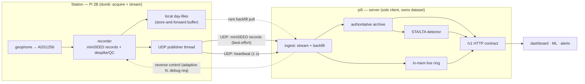

# Rev-2 data plane — station ↔ pi5 streaming + the server split

**Status: DESIGN COMPLETE / build not started.** This is the agreed architecture for
how seismic data leaves the station and reaches downstream apps in rev-2. It supersedes
the current rsync-mirror plumbing. Built so far: only the read-side of the server module
(`server/`, a draft façade — see §12). The **Phase-1 design pass is done** — all §14
open items are resolved with concrete decisions (wire format, N, backfill, heartbeat,
retention, ports, build order). Captured from design sessions 2026-07-24 / -07-25 so the
reasoning isn't lost; freeze specifics as we implement.

Companion docs: `rev2-frontend.md` (the analog interface board), `../STATUS.md`
(current running system), `../BACKLOG.md`.

---

## 1. Why — the split

Break today's single pi5 app into two things along a **contract**, not just a
process boundary:

- A **pure server** (middleware) that is: **(a)** the *sole* client that talks to
  the station to retrieve data, **(b)** the maintainer of the full dataset of
  readings, and **(c)** the server of that data to downstream consumers.
- **Consumers** — the dashboard first, then any ML / alert / correlation app —
  which become clients of the server's contract and never touch station files or
  the station's address.

Today none of (a)/(b) is true: **three** things talk to the station (a host
rsync timer, a live-ring pull service, and the dashboard's live proxy), and the
"dataset" is maintained by the recorder + rsync, not by any server. Rev-2 makes
the server actually own (a)+(b)+(c).

## 2. Current transport (what we're replacing)

Everything on the pi5 is a **file in an rsync mirror**, polled at two cadences:

- **Archive (~60 s):** host `seismo-rsync.timer` mirrors `seismo.local:~/seismo/
  {data,events.log,health.json}` each minute → helicorder/spectrum read it.
- **Live (~3 s):** a separate `seismo-live-pull` copies the `/dev/shm/
  seismo_live.npz` ring → the dashboard strip-chart reads it. (Recorder's
  `live_publisher` republishes that ring every 0.3 s.)

Both are fundamentally **streams forced through periodic file-polling**, and each
poll pays an SSH-handshake tax. The two-cadence split is a symptom of having
thrown the stream away and re-discovered it by polling.

## 3. Roles & principles

- **Station (Pi 2B) stays dumb.** Its one job is reliable ADC acquisition. It
  runs **no resident serving daemon** — in particular **no SeedLink server**
  (ringserver is overwrought for a 1 GB ARMv7 box whose sample loop must never be
  starved; standard-protocol serving belongs on the capable machine). The station
  *acquires, writes a local buffer, and streams once.*
- **pi5 does everything heavy** — ingest, the authoritative archive, detection,
  serving, and (if ever wanted) re-exposing SeedLink/FDSN **downstream**.
- **Network reality:** the station is on the **Ethernet bridge**, which **uplinks
  over WiFi**. So the WiFi hop is a property of the *network path* (loss /
  jitter / airtime), **not** the Pi-2 RF-into-ADC concern (that was the WiFi
  *dongle's* conducted 5 V-rail current, engineered away by the bridge). Push
  vs pull is therefore RF-neutral; the WiFi hop only shapes reliability tuning.

## 4. Transport — UDP streaming

Keep it a **stream end-to-end**; derive both outputs on the pi5 from one flow.

- The recorder gains a **publisher thread** that pushes each packed **miniSEED
  record** out a UDP socket, using the existing queue-drain pattern
  (`live_publisher`/`writer`): the sampler enqueues, the publisher sends, and if
  the link is dead the sampler **never blocks** (fail-open).
- **Wire format = miniSEED records** — self-describing (SEED id, rate,
  timestamps embedded), idempotent by start-time, and literally what a SeedLink
  stream carries if the pi5 later re-exposes one.
- **Datagrams ≤ path MTU (~1472 B). Never fragment** — a fragmented UDP datagram
  is lost entirely if any fragment drops, and that multiplies loss over the WiFi
  hop. One ~512 B record per datagram, or batch ~2 records to near-MTU.
- **Best-effort, no wire-level retry** (reliability lives elsewhere — §5).
- Each datagram carries a **monotonic sequence number** so the receiver can
  detect gaps and — with a seq — distinguish *wire loss* (backfill it) from a
  *real acquisition gap* (a dropped ADC sample — genuinely absent, don't backfill).

Batching is for **airtime-citizenship**, not loss avoidance (size didn't affect
loss in testing, §5). This is a trickle (~a few hundred B/s), never near
saturation; WiFi's per-frame overhead is the only reason not to spray tiny frames.

## 5. Reliability model

Two different requirements, handled separately:

**Live path — best-effort, fire-and-forget.** Lose a packet → the strip-chart
skips one update; the next arrives in ~1 record period. Live loss is never
recovered into the ring (transient by nature).

**Archive completeness — durable, but lazy.** The recorder keeps writing **local
day-files**, now demoted from "the archive" to a rolling **store-and-forward
buffer**. The pi5 detects sequence gaps and **backfills** them from those files,
out of band. This is the retry — at the archive layer, not per-packet. Backfill
is **rare catastrophe recovery** (pi5 reboot/redeploy dropping minutes of
datagrams), *not* routine plumbing.

**Redundancy — "send last N" (sliding-window repetition), for the common case.**
Each datagram carries records `[k-N+1 … k]`; copies of record `k` ride *different*
datagrams sent at *different* times, so they're temporally spaced. Record `k` is
lost only if **N consecutive datagrams all drop** — i.e. it defeats any loss
*burst shorter than N*.

- **Design input = the loss burst-length distribution**, not the raw rate. If
  losses are isolated singles, **N=2 recovers ~all**; if bursts reach length 5,
  you need N ≥ 6. (This is what the 24 h probe measures — below.)
- **MTU caps N.** At ~512 B/record, N=2 fits, **N=3 fragments**. To go deeper:
  **smaller records** (50-sample ≈ 256 B → N=5 fits) or **parity FEC** (one
  XOR/RS parity record covers the window for far fewer bytes). Don't fragment.
- **Complements backfill, doesn't replace it.** Repetition handles small wire
  bursts inline (no rsync, no reaching back); backfill handles large gaps UDP
  can't. Net: rsync goes from routine to rare — the stated preference ("add a bit
  of UDP rather than fire a heavy rsync").
- **Adaptive N** (§7): default N=1 (zero overhead), crank up only when loss is
  observed. Expected change frequency: **daily at most.**

**Loss-detection latency** (bounded by cadence; UDP has no per-packet ACK):
- *Interior loss* — detected when the successor arrives with a jumped seq ≈ **one
  record period** (~1.75 s at 100-sample/57 sps).
- *Tail loss* — no successor; detected via the heartbeat's high-water seq ≈ **one
  heartbeat interval** (§6). Allow a small **reorder-grace** (a few hundred ms —
  though testing showed *zero* reordering, so it can be tiny) before declaring a gap.
- Detection speed barely matters: backfill is lazy, live loss isn't recovered.

**Empirical (2026-07-24):**
- *Spot test* — station→pi5, 512 B & 1400 B, 50 pps & 5 pps: **3600 packets, 0
  loss, 0 reorder, 0 dup**; jitter p99 ≤ 41 ms. Size didn't matter.
- *24 h probe — DONE* (2026-07-24→25, 864,000 pkts, 10 pps × 512 B): **0.0073 %
  loss** (63 lost), 0 reorder, 0 dup. 16 loss events, **sporadic across the day** (no
  time-of-day pattern), **worst fade 1.4 s** (14 pkts). Burst hist (pkts): 1×7, 2×2,
  3, 4, 7×2, 8, 9, 14. → **Redundancy fixed at N = 2** (see §14.0 for the 100 sps
  re-derivation — at 57 sps the 1.75 s cadence meant a 1.4 s fade dropped ≤1 datagram
  and N=2 recovered 100 % inline; at 100 sps the cadence is 1.0 s, so the worst fade can
  drop both copies and that tail falls to backfill). No adaptive-N machinery needed.

## 6. Heartbeat

A small station→pi5 UDP pulse at a **fixed ~1 s cadence**, separate from data
(its *absence* is the signal). Payload: `hi_seq` (highest data seq sent),
`hb_seq`, station UTC `t`, and the acquisition/QC counters currently in
`health.json`. It does **three jobs**:

1. **Liveness** — K missed pulses → "station/link down" alarm in ~K s, regardless
   of whether data was flowing (disambiguates "quiet but fine" from "dead").
2. **Tail-loss detection** — `hi_seq` closes the last-packet-lost hole; bounds
   worst-case gap detection to one heartbeat interval.
3. **Health/metadata transport** — carries the counters not in the sample records,
   **replacing the `health.json` rsync pull**; feeds `/v1/health`.

Best-effort and self-healing: liveness uses a K-of-N threshold; `hi_seq` is
cumulative so a lost heartbeat is re-reported by the next. No retry machinery.

## 7. Reverse control channel & adaptive N

Only needed for adaptive redundancy / debug requests; expected use **≤ daily**, so
optimize for **simplicity, robustness, restart-safety — not latency.**

**Invariants (all approaches):**
- **Idempotent absolute set-value** ("set N=3", never "N++") + a **generation
  counter** so a stale duplicate can't downgrade.
- **Hot-reload, never restart** the acquisition loop.
- **Persist on the station** (survive recorder restart) and **echo `current_n` in
  the heartbeat** — that echo *is* the ACK; no separate confirm message.
- **Clamp/validate** to `[1, N_max(MTU)]`; ignore garbage.

**Approaches:**
- **A — reply on the heartbeat (recommended).** pi5 replies to the station's
  heartbeat datagram with desired config. No inbound port on the station, station
  stays outbound-initiated, self-healing (~1 s effective), zero new machinery.
- **B — dedicated push datagram.** Needs a small inbound listener on the station;
  it's just A as a push. Skip.
- **C — SSH'd config file + hot-reload (bulletproof).** N in a file the recorder
  watches by mtime; pi5 writes it via an occasional SSH. Durable/restart-safe by
  construction, reuses existing plumbing, no new protocol; daily SSH is fine.
- **D — station polls pi5 `/v1/config`.** Outbound-only like A but redundant with
  the already-open heartbeat channel.

Pick **A** (elegant, SSH-free, no inbound port) or **C** (least code, hardest to
break). For a hobby build, **C first**, graduate to A if wanted. Decision policy
lives on the pi5 (it *is* the receiver, so it measures loss directly): once a day,
`N = max_burst_today + 1` (capped at `N_max`), lower conservatively after a clean
stretch (hysteresis to avoid flapping).

## 8. Config knob classes — the firewall that matters

Two classes; **the adaptive channel may only ever touch Class 1.**

**Class 1 — transport / derived. Safe to hot-tune on the reverse channel.** None
change what a recorded sample *means*.

| Knob | Note |
| --- | --- |
| **N** (redundancy depth) | the driver |
| **record size / samples-per-record** | N's MTU escape hatch |
| send cadence / batching | live-latency vs airtime |
| heartbeat cadence | liveness/tail-loss responsiveness |
| local buffer / backfill retention | longer outages → keep more |
| transmit pause/resume | stop *streaming*, not acquiring |
| debug verbosity | on for a session |
| backfill-range request | a *command* on the same channel |

**Class 2 — instrument / epoch. Deliberate, human, logged as a new epoch. NEVER
on the auto path** (an auto-policy nudging these would silently break scientific
continuity):

`GAIN` · `DRATE`/declared `RATE` · despike/QC thresholds · SEED id · block size.

## 9. Detector → pi5 (DECIDED)

Move STA/LTA off the station entirely.

- **Leaves the station:** the inline `StaLta` call, `stalta.py`, `events.log`
  emission, the `TRIG/STA/LTA/HP` knobs, and the "can never break acquisition"
  scaffolding. The recorder sheds real per-sample CPU (HPF + energy CF + ratio).
- **Stays on the station:** **despike/QC** — it alters recorded samples (Class 2),
  part of producing the clean archive. The pi5 detects on the *despiked* stream.
- **pi5 gains retroactive re-detection** — retune thresholds and re-run over the
  whole archive, not just going forward. Ideal while fighting false positives
  (every trigger to date is one). Detection latency inline → ~2 s + processing:
  negligible for hobby alerting.

## 10. Telemetry — three tiers (DECIDED)

The "second debug stream" idea is real but narrower than it looks; most of the
wishlist belongs on channels we already have.

- **Tier 1 — always-on safety vitals** (undervoltage, temp/moisture out-of-range):
  ride the **heartbeat/health** channel — never gate a freeze/bake/flood/brownout
  alarm behind an off-by-default stream. **Undervoltage is a data-quality event**
  (brownout → sample-rate drops / square-wave plateaus): station reads
  `vcgencmd get_throttled` (bit 0 = now, bit 16 = has-occurred) and writes it
  **inline to the QC log**, same as `dropped`/`spike`, so analysis excludes the
  window.
- **Tier 2 — always-on slow environmental metadata** (temp, moisture, voltage
  *level*): **archived, time-aligned** with the seismic stream — it's *scientific*
  metadata (moisture may correlate with noise), not diagnostics. Store as SEED
  **state-of-health channels** (as Raspberry Shake does), correlatable against the
  noise floor. Per-minute is plenty.
- **Tier 3 — on-demand verbose ops debug** (CPU/per-core, memory, disk I/O,
  network, SPI/DRDY timing, scheduler latency): the *requestable* stream. Rides
  the reverse channel: `{topics, rate, duration}`, **time-boxed with auto-expiry**
  (a forgotten session must not stream forever). Gathered in a low-priority thread,
  **off the acquisition path** (`vcgencmd` forks; keep it slow). **Loose JSON,
  best-effort, no redundancy** — different constraints than the data path, so
  different rules; schema can evolve freely.

**Sensors (future):** temp/moisture on **I²C or 1-Wire** (separate bus from the
ADS1256's SPI → no acquisition contention). **Capacitive** soil-moisture (resistive
corrodes in wet ground); DS18B20 for temp. Keep powered probes **away from the
coil** (noise source — which is also why the moisture-vs-noise correlation is worth
recording).

## 11. Environmental sensing subsystem (DECIDED: ESP32-WiFi islands)

The Tier-2 environmental sensors (§10) are a **separate electrical island**, not
hung off the station. Each is an **ESP32-WiFi node** reporting to the pi5/server
directly; the Pi 2 never sees them and shares **neither its power nor its ground**
with them. This is the clean resolution of the "sensor near the coil" problem —
there is no galvanic path from any sensor to the acquisition chain at all.

- **Why ESP32-WiFi (not PoE Ethernet / sub-GHz):** a mesh AP sits right above the
  crawl space, so the 2.4 GHz link budget has ample margin — which removes the
  usual crawl-space objection to WiFi and makes ESP32 the cheapest, most-isolated,
  no-cabling option. Fallbacks on record: **PoE Ethernet** (inherently
  transformer-isolated, one-cable power+data) if a future node lands in a WiFi
  dead spot; **sub-GHz / LoRa** only if something ends up buried or behind too
  much wet mass (2.4 GHz is the *worst* band next to wet soil).
- **Placement — probe in the ground, brains in the air.** Only the moisture probe
  enters the soil; the ESP32 + antenna stay elevated and dry. Water at the antenna
  is a *near-field* detune/absorption effect independent of AP distance, and
  elevation also keeps the electronics out of the damp.
- **One node, several sensors.** A single node per location carries DS18B20 temp +
  capacitive moisture (resistive probes corrode in wet ground) + whatever's added
  later — one cheap node per spot, not one per sensor.
- **Power** is the only maintenance question, answerable per node: a local 5 V wire
  is fine here (a shared ground on the *environmental* island is harmless — it's
  not the seismic chain), or deep-sleep + report-every-minute on battery for a
  truly untethered node.
- **Protocol:** low-rate and loss-tolerant → **fire-and-forget, no reliability
  machinery** (same posture as Tier-3 debug telemetry). MQTT to a broker on the
  pi5, or a periodic HTTP POST / UDP datagram the server ingests.
- **Where it lands:** the server timestamps each reading and archives it as a SEED
  **state-of-health channel** (§10 Tier-2), time-aligned with the seismic stream
  for the noise-vs-environment correlation. Transport per node is opaque to ingest
  — mix WiFi / PoE / battery freely; they all arrive as the same telemetry.

**Invariant:** the environmental mesh shares neither power nor ground with the
station. Keep it a separate electrical island and the correlation data comes for
free with zero acquisition risk.

## 12. The server module & `/v1` contract

A draft exists at **`server/`** (read-side only):

- `store.py` — `SeismoStore`, the **backend-swappable** archive/live façade; the
  *only* code that knows how data physically arrives. Today it reads the rsync
  mirror; rev-2 swaps that backend for the **UDP ingest + local archive** with no
  change to consumers.
- `seismo_server.py` — thin stdlib HTTP layer. **Contract (v1):** `/v1/health`
  (station counters + `mirror_age_s`), `/v1/live` (30 s ring), `/v1/events`
  (unfiltered by default — MIN_RATIO is *consumer* policy), `/v1/waveform`
  (`format=json|mseed`). CORS-open, read-only. Verified end-to-end against a
  synthetic mirror.

The serve side survives rev-2 intact; only the **ingest side** changes (mirror-read
→ UDP stream + backfill + owned archive).

## 13. Migration & scope

This is a **stateful ingest+storage daemon** that also changes the station — a
multi-day effort, not the read-façade draft. **End-to-end before polish; don't
break the one job.** Suggested order:

1. Recorder publisher thread (fail-open) streams UDP **alongside** the existing
   files — nothing retired yet. pi5 ingest persists the owned archive + live ring.
2. Add heartbeat (replaces `health.json` pull) and seq/backfill.
3. Move the detector to the pi5; re-run over the archive.
4. Cut the dashboard onto `/v1/*`; delete its `/data/*` reads, `SEISMO_LIVE_URL`
   proxy, and the file-watching envelope build (→ server-side).
5. **Only then** retire the host `seismo-rsync.timer` and `seismo-live-pull`.
6. Redundancy N (fixed from the probe first; adaptive channel later if needed).

## 14. Design decisions — RESOLVED (Phase-1 design pass, 2026-07-25)

The §14 open items are resolved below. Governing constraints unchanged: never
starve the ADC loop (fail-open everywhere), station stays dumb, reliability lives
in the archive layer not per-packet.

### 14.0 ⚠️ 100 sps changed the N math — re-derived

N=2 was derived at 57 sps, where 100-sample records = **1.75 s/datagram**. The
station is now **100 sps** (2026-07-25 epoch, see STATUS), so a 100-sample record
is **1.0 s/datagram**. N=2 sends record *k* in datagrams *k* and *k+1*, now only
**1.0 s apart** — so the worst observed fade (**1.4 s**) can drop *both* copies,
which it could not at 1.75 s spacing.

**Decision: keep 100-sample / 512 B records, N=2.** N=2 still recovers the *common*
1–2-datagram bursts inline (the bulk of the 24 h probe's 16 loss events); the rare
>1 s fade falls to **backfill** (§14.4) — the §5 live-vs-archive split. The live
strip-chart skips ~1 s about once a day; the archive is healed. Rejected: 50-sample
/256 B records + N=4 (0.5 s cadence, covers 1.4 s inline) — 2× datagrams and
machinery to claw back a once-a-day 1 s live blip backfill already fixes.
**N_max at 512 B = 2** regardless (N=3 = 1536 B > MTU, fragments).

### 14.1 Datagram wire format

`8-byte header + n_records × 512 B miniSEED records`, network byte order:

| off | field | bytes | note |
| --- | --- | --- | --- |
| 0 | magic `0x53 0x5A` ("SZ") | 2 | cheap sanity/version filter |
| 2 | version = 1 | 1 | |
| 3 | n_records | 1 | = effective N in this datagram |
| 4 | seq | 4 (u32) | datagram counter since recorder start |

Records follow **verbatim** — the exact bytes the file writer packs, so the pi5
archive is byte-identical to what the station would have written. Max datagram =
8 + 2×512 = **1032 B < 1472 MTU**. ✓ Never fragment.

### 14.2 Idempotency / dedup / gap detection = record START-TIME

Key the archive on `(channel, record start-time)` from the miniSEED fixed header —
**not** the seq. N=2 overlap and backfill re-sends dedupe identically. `seq` is only
a liveness/telemetry hint (did we miss datagrams recently), so its reset-on-restart
is harmless. On collector restart, rebuild the "seen" set by scanning the current
day-file's record headers (cheap — start-times only).

### 14.3 Reverse channel — NOT needed in Phase 1

Adaptive N is deferred: **N is fixed at 2**, a Class-1 constant in the unit env.
Backfill is pi5-initiated (§14.4), so the station needs no inbound port and stays
outbound-only. Revisit §7 (pick **C** — SSH'd config file + hot-reload) only when
adaptive N is actually wanted.

### 14.4 Backfill = pi5-initiated rsync of the local buffer

On a detected start-time gap that N=2 didn't fill (bounded by the heartbeat
interval, §6), pi5 `rsync`s the affected day-file from the station's local buffer
and merges the missing records (dedup by start-time absorbs the overlap). This is
**rare catastrophe recovery** (pi5 reboot/redeploy), so a whole-day-file pull is
acceptable — no custom range-request protocol. Reuses existing SSH/rsync plumbing.

### 14.5 Heartbeat — in Phase 1 (replaces the health.json pull)

Station→pi5 UDP pulse ~1 s on a **separate port**; JSON payload = `hi_seq`,
station UTC `t`, and the acquisition/QC counters now in `health.json`. Jobs:
liveness (K missed → down alarm), tail-loss bound, and it **retires the health.json
rsync**. Best-effort, no retry (§6).

### 14.6 Archive layout & retention

- **pi5 collector** writes `~/seismo-archive/` (distinct from the `~/seismo-data/`
  rsync mirror during migration), same day-file naming. Keeps the **full archive**
  — ~44 MB/day @100 sps ≈ 16 GB/yr, trivial; STEIM2-compress old days later if wanted.
- **Station local buffer** (store-and-forward): retain **~14 days**, then prune —
  it exists only to serve backfill.

### 14.7 Publisher tap point (station)

The file writer packs each 512 B record; after packing, it also enqueues those exact
bytes to a **bounded** publisher queue (`put_nowait`, **drop-on-full = fail-open**).
A publisher thread keeps a deque of the last N records and sends one datagram per new
record carrying `[k-N+1 … k]`. It never touches the ADC/SPI path; a dead link only
drops from the publisher queue, never back-pressures acquisition.

### 14.8 Ports

Two fixed random high UDP ports, **station→pi5 only** (LAN): data **48317**,
heartbeat **48318**. pi5 firewall allows inbound UDP from the station on both.

### 14.9 Deferred to Phase 2 (not Phase-1 blockers)

- **Envelope builder** migration (dashboard → server) — moves when the dashboard is
  cut to `/v1/*`.
- Detector → pi5 (§9), retire `seismo-rsync.timer` + `seismo-live-pull` (§13.4–5),
  reverse channel / adaptive N (§7).

### 14.10 Refined Phase-1 build order

1. **Publisher thread (fail-open) + minimal collector** writing the owned archive
   **alongside** the existing rsync (nothing retired) → verify byte-faithful vs the
   rsync mirror with obspy.
2. **Heartbeat** (retires health.json pull) + **start-time gap detection** +
   **rsync backfill**.

Then Phase 2 separately.
