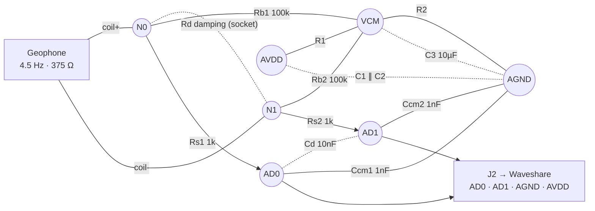

# Rev-2 geophone → ADS1256 interface board

**Status: DRAFT / not frozen.** This is the working design for the permanent
front-end board that replaces the current perfboard (2× 100 kΩ bias + shunt
socket + XLR in). It is a *passive* differential network — bias, damping,
anti-alias/charge-reservoir — feeding the ADS1256's differential input. All
active gain (PGA ×64) and the input buffer live **inside** the ADS1256, not on
this board.

Two decisions are still open (see [Open decision](#open-decision--vcm-voltage)),
so the values here are the prototype starting point. Freeze them on the perfboard
via the shorted-input floor test **before** laying out the PCB — see
`../BACKLOG.md` (“Custom PCB — do it, but only once Rev-2 is frozen”).

## Topology (signal flow)

Mermaid sketch of the network — **topology only**, not a literal schematic
(dotted links = components *across* two nodes; solid links = series components).
The authoritative netlist is the net table in the next section.



The **XLR J1** shield (pin 1) is not in the graph: it goes to the **single star
ground** point (bonded to AGND once, at the Pi end), *not* to the signal return.

## Schematic (authoritative netlist)

The **net table is the authority** — one row per net, every component terminal
on exactly one net. This is the bring-up checklist: buzz out each row with a
multimeter; a net passes when every listed pin beeps to every other pin in the
row (and to nothing in any other row). Two-terminal passives use `.1`/`.2`
(assignment arbitrary for every part *except* possibly **C1** — see the polarity
note below). J2 pins are numbered per
the connector pin order `AVDD · AGND · AD0 · AD1`
(see [Connectors](#connectors-internal-wiring)).

| Net | Pins on this net | Pins |
|-----|------------------|------|
| **AVDD** | J2.1 (AVDD) · R1.1 · C1.1 · C2.1 | 4 |
| **VCM** | R1.2 · R2.1 · C3.1 · Rb1.2 · Rb2.2 | 5 |
| **AGND** | J2.2 (AGND) · R2.2 · C1.2 · C2.2 · C3.2 · Ccm1.2 · Ccm2.2 | 7 |
| **N0** (coil+) | J1.2 · Rb1.1 · Rd.1 · Rs1.1 | 4 |
| **N1** (coil−) | J1.3 · Rb2.1 · Rd.2 · Rs2.1 | 4 |
| **AD0** | Rs1.2 · Cd.1 · Ccm1.1 · J2.3 (AD0) | 4 |
| **AD1** | Rs2.2 · Cd.2 · Ccm2.1 · J2.4 (AD1) | 4 |
| **SHIELD** | J1.1 — runs to the single star-ground point at the Pi end, bonded to AGND **once** there. Deliberately *not* tied to AGND on this board. | 1 |

Total 33 pins (13 two-terminal parts ×2, J1 ×3, J2 ×4), each on exactly one net.

Topology facts the table encodes, spelled out:

- **Rd** spans **N0–N1** — coil side, *before* Rs1/Rs2, so the series R doesn't
  perturb the damping.
- **Cd** spans **AD0–AD1** — ADC side, *after* Rs, right at the sampler pins.
- **C1/C2** bypass AVDD→AGND at the **J2 entry**, *upstream* of R1.

**C1 polarity — OPEN.** Everything else on the board is non-polar. C1's dielectric
is not yet decided, and the choice is not cosmetic: C1's ESL parallel-resonates
with C2's capacitance, producing an impedance *peak* (anti-resonance) between
their two self-resonant frequencies, where the pair is worse than either alone.
That peak is damped by ESR — so an electrolytic or tantalum for C1 is
**preferable** to a low-ESR ceramic here, the one place a mediocre capacitor is
the better part. If C1 ends up electrolytic/tantalum, `C1.1` = **+** (AVDD side)
and `C1.2` = **−** (AGND side), and the BOM needs a voltage rating ≥ 2× AVDD.

### Drawing (orientation only — the table wins on any discrepancy)

Conventions: `┬`/`┴` = electrical junction; a component label interrupts its
own vertical wire; a bare name at the end of a stub (`VCM`, `AGND`) means the
stub joins that net — same nets in both drawings.

Rails (all at the J2 end of the board):

```
J2.1 AVDD ●───┬──────────────┬─────────┬
              │              │         │
             R1             C1        C2      C1 10µF ∥ C2 100nF — bypass at
              │              │         │      J2 entry, upstream of R1
    VCM ●─────┼────┬         │         │
              │    │         │         │      C3 10µF — VCM filter
             R2   C3         │         │      R1/R2 — see Open decision
              │    │         │         │
J2.2 AGND ●───┴────┴─────────┴─────────┴
```

Signal path (VCM and AGND stubs join the rails above):

```
J1.2 (coil+) ●── N0 ──┬────────┬──[Rs1 1k]── AD0 ──┬────────┬──● J2.3 (AD0)
                      │        │                   │        │
                     Rb1       Rd                 Cd      Ccm1
                     100k   (socket)             10nF      1nF
                      │        │                   │        │
                     VCM       │                   │       AGND
                               │                   │
J1.3 (coil−) ●── N1 ──┬────────┴──[Rs2 1k]── AD1 ──┴────────┬──● J2.4 (AD1)
                      │                                     │
                     Rb2 100k                             Ccm2 1nF
                      │                                     │
                     VCM                                   AGND

J1.1 (shield) ●─────────────────────────────► star ground — single point at
                                               the Pi end, bonded to AGND once
                                               there (NOT the signal return)
```

## Net-by-net

- **Geophone coil** sits directly across **N0–N1** (XLR pins 2/3). All
  AC-relevant sensor behavior happens at this node.
- **VCM (common-mode bias)** — divider R1/R2 off AVDD, heavily filtered by
  **C3 (10 µF)** into a dead-quiet AC ground. **Rb1/Rb2 (100 k)** pull each coil
  terminal to VCM to set the DC operating point without shorting the differential
  AC. The 375 Ω coil dominates the differential source impedance, so the bias-R
  Johnson noise is largely shunted.
- **Rd** — shunt **damping** resistor across the coil, **socketed**, tuned
  empirically against a recorded impulse (~0.7 critical). Placed at N0–N1,
  *before* the series R, so Rs doesn't perturb the damping.
- **Rs1/Rs2 (1 k) + Cd (10 nF) + Ccm1/2 (1 nF)** — anti-alias / charge-reservoir
  RC. Cd right at the ADC pins feeds the switched-cap sampler's charge spikes;
  the CM caps knock down RF. Corner ≈ **8 kHz** differential (see
  [Anti-alias note](#anti-alias--charge-reservoir-note)).
- **C1 ∥ C2 (10 µF ∥ 100 nF)** — AVDD supply bypass, both AVDD→AGND at the **J2
  entry point**, upstream of R1. AVDD arrives over the JST cable, so this is the
  local reservoir at the far end of an inductive run. Two values because neither
  spans the band alone: C1 is bulk (low-Z below ~kHz), C2 takes over above C1's
  self-resonance. They matter because AVDD is the reference for the R1/R2 divider
  — rail noise divides straight into VCM, and while that is common-mode (mostly
  rejected), Rb1/Rb2 mismatch and finite CMRR leak some of it differential. C3
  filters VCM as the second stage. **Layout:** C2 as close to the J2 pins as
  physically possible; both must return to the *same* AGND point J2 lands on, or
  the bypass current ends up in the signal ground path.
- **Shield (pin 1)** → the single star-ground point, not the signal return.

## BOM (prototype starting values)

| Ref | Value | Role |
|-----|-------|------|
| R1, R2 | 100 k (see decision) | VCM divider |
| Rb1, Rb2 | 100 k | input bias to VCM |
| Rd | socket, ~1–5 k | shunt damping (tune) |
| Rs1, Rs2 | 1 k | series to ADC (keep ≤1 k) |
| Cd | 10 nF C0G | differential reservoir / AA |
| Ccm1, Ccm2 | 1 nF C0G | per-input RF to AGND |
| C1 / C2 | 10 µF / 100 nF | AVDD bypass |
| C3 | 10 µF | VCM filter |
| J1 | XLR (PCB-mount, Neutrik) | geophone in |
| J2 | 4-pin JST-XH | AD0 / AD1 / AGND / AVDD to Waveshare |

## Open decision — VCM voltage

This *is* the buffer / AVDD question. The board is identical across all three
options — only R1/R2 and the AVDD jumper change — which is why it stays on the
perfboard until one is chosen:

| Config | R1 / R2 | VCM | Buffer |
|--------|---------|-----|--------|
| Current: AVDD = 3.3 V, buffer **off** | 100k / 100k | 1.65 V | off (noisier) |
| AVDD = 3.3 V, buffer **on** | 180k / 100k | 1.18 V | on — needs VCM < 1.3 V |
| **Resolve 5 V AVDD**, buffer **on** | 100k / 100k | 2.5 V | on (range 0–3 V) ✓ |

Buffer-on is the real noise-floor win, and it also collapses the switched-cap
input current — so the bias-R offset shrinks and Rb could rise to 1 M (lower
loading, less noise). The 5 V AVDD path is blocked on a hardware fault
(jumpering AVDD to 5 V crashed the Pi — suspected a 3-pin cap shorting 5 V↔3V3;
investigate with the Pi OFF, pins verified). See `../BACKLOG.md` item 1.

## Anti-alias / charge-reservoir note

The earlier backlog phrasing ("1 kΩ + 10–47 nF, corner ~60–80 Hz") was wrong:
1 k×2 + 10–47 nF lands at **~1.7–8 kHz**, not 60–80 Hz — and the kHz corner is
the *correct* behavior. The analog RC's job here is charge-reservoir for the
switched-cap input + RF/modulator-alias rejection; the ADS1256's digital SINC
filter does the decimation anti-aliasing. A true ~30 Hz analog corner would need
~25 k series R, which wrecks gain accuracy and adds noise on the unbuffered
input — **don't**. Keep the corner in the low kHz.

## Alternatives worth knowing

- **VCM from VREF (2.5 V)** instead of an AVDD divider, if CM stability
  independent of the supply is wanted. (For a floating differential source the
  CM point only needs to stay in range, so the filtered AVDD divider is fine.)
- **Rb → 1 M** once the buffer is on (input current collapses → lower loading,
  less noise).

## DESIGN FOR TEST — the source must be swappable without a soldering iron (2026-07-27)

**Requirement, not a nicety.** On the current perfboard everything at the geophone end is
soldered, which means the **shorted-input floor test cannot be run** — and that test is
the one measurement separating *site ambient* from *electronics noise*. Until it runs,
every front-end decision below is "build it and see" rather than "measure, then build".
Deferring it to this board is the right call, but only if this board fixes it.

**What Rev-2 must provide:**
- **Detachable geophone input.** Crimp ferrules into a plug, or a proper connector — not
  tinned strands in a screw terminal (`CLAUDE.md` already flags those as cold-flowing
  and loosening). Needed anyway once the sensor is buried outside.
- **A dummy-source plug** that drops into the same connector: ~390 Ω metal film across
  the two signal pins. Any construction is fine — at 0.1–50 Hz a wirewound's few µH is
  ~3 mΩ, and with ~16 µA of bias current the resistor drops 6 mV so excess noise is
  single-digit nV. The point is only to preserve the DC operating point while removing
  the sensor.
- **A shunt-damping socket that actually accepts a bare resistor lead.** Phase 3 is still
  unchecked and the value must be tuned empirically against a recorded impulse.
- **Keep the shunt at the BOARD end**, not at the sensor. Once the geophone is buried
  (see BACKLOG), a few metres of cable adds well under an ohm against 385 Ω, so damping
  stays tunable indoors instead of being potted into the ground.

**The three-configuration protocol this enables** (differences localise the noise):

| configuration | measures |
|---|---|
| dummy at the **board**, cable disconnected | electronics only |
| dummy at the **far end** of the cable, cable connected | electronics + cable pickup |
| geophone connected | everything |

Run each ≥20–30 min, late at night, changing nothing else, and allow ~40 min settling
after each swap ([[settling-time-after-handling]]).

**The specific number to compare** is the sub-Hz floor. Deconvolving the 2026-07-27
Nevada M3.4 recording showed noise rising as ~f⁻² below the corner (0.94 µm/s at
1–3 Hz → 81 µm/s at 0.15–0.5 Hz) with **no microseism bump** — the signature of
flat-in-counts noise amplified by the inverse response, i.e. NOT ground translation. If
that floor survives with a resistor in place of the geophone it is electronics; if it
collapses, the sensor is moving (tilt/thermal) and burial is the fix.

## Analog filtering — LOW-PASS, not a notch (decided 2026-07-27)

Considered a 60 Hz twin-T notch and rejected it. **A notch tracks one frequency and the
grid drifts**; a low-pass does not care, and also kills the ~57.5 Hz compressor rate that
folds to 42.5 Hz. Raspberry Shake did exactly this — their V6 is 0.8–29 Hz with complex
pole pairs near 31 and 49 Hz, i.e. deliberate roll-off well below Nyquist, not a notch.

- **Why it matters at 100 sps:** the sinc nulls now sit at 100/200/300 Hz, so 60 Hz gets
  only ~6 dB before folding to 40 Hz where nothing can remove it. At the old 60 sps the
  null sat *on* mains: ~70 dB even with normal ±0.02 Hz grid drift, ~56 dB at ±0.1 Hz.
  Drift nibbles at the notch; changing the sample rate threw it away.
- **A 4-pole low-pass at 30 Hz** gives ~48 dB at 60 Hz, plus the sinc's 6 → ~54 dB, with
  no precision matching required (a passive twin-T's depth is limited by component match).
- **Must be differential** — two matched sections or a differential active stage. Any
  mismatch converts common-mode hum into differential signal.
- **Wants buffer-on.** With the buffer off the switched-cap input loads a passive filter
  and detunes the corner. Queues behind the 5 V AVDD change, like everything else.
- **CORNER IS A REAL TRADE.** 30 Hz is ideal for the earthquake mission (1–15 Hz
  untouched) but guts the **15–45 Hz band** used for near-field source ID — the A/C's
  three-level state machine, the mount-mode ratio, the near-field discriminator. 40–45 Hz
  keeps source ID alive at ~34 dB on mains instead of ~54. Decide which mission wins.

## LNA — correct architecture, currently invisible (assessed 2026-07-27)

`coil → LNA → filter → ADC` is the right order (gain first; filtering ahead of the
amplifier adds resistor noise where nothing has amplified the signal yet).

| source | input-referred noise density |
|---|---|
| geophone coil, 385 Ω thermal | 2.5 nV/√Hz |
| ADS1256 @ PGA 64, ~24 Hz noise BW | ~33 nV/√Hz |
| AD8429 / INA163 class | ~1 nV/√Hz |

So the converter is ~13× noisier than the sensor. **Move gain, don't add it** — LNA ×100
with PGA ×1 instead of PGA ×64: same total gain, same clipping point, noise set by a
1 nV/√Hz part. That takes the electronics floor from ~0.12 µV to ~0.01 µV over 1–15 Hz.

**But the measured floor is 1.17 µV — ten times above where the electronics already sit.**
An LNA would improve a term that is not dominant. Do the shorted-input test first; if it
returns ~0.1 µV, the entire front-end programme is chasing 8 % of the noise and the effort
belongs in coupling and siting instead.

## Layout tooling — KiCad rejected (2026-07-23)

The KiCad project was created and then deleted: Charles dislikes schematic capture
as a way of thinking about a circuit. **This is not a blocker**, because nothing
about Rev-2 needs a PCB tool yet -- the design of record is the net table + BOM
above, and the schematic image comes from `rev2_frontend_schematic.py` (schemdraw,
Python), matching the code-first workflow already used for the enclosure (build123d).

When layout *does* become due -- only after Rev-2 is frozen, i.e. after the
buffer/AVDD decision and an empirically tuned `Rd` -- the options that skip
schematic capture entirely:

- **SKiDL** (Python) -- define the circuit in code, emit a KiCad netlist directly.
  The netlist above is already written; this just formalises it.
- **atopile** -- newer text-based EDA language, compiles to a KiCad PCB.
- **EasyEDA** -- browser-based and JLCPCB-integrated (where the board would be
  fabbed anyway), much lighter than KiCad.

Routing is inherently spatial, so *some* tool has to place and route; `pcbnew` is a
different mental model from `eeschema` and may be tolerable even if the schematic
editor isn't. For ~14 passives with no ICs, layout is a ~30 minute job in anything.

## Connectors (internal wiring)

- **J1 geophone in** — board-mounted XLR jack (Neutrik PCB series); the geophone
  cable's XLR plugs straight in, no solder-to-cable.
- **J2 to Waveshare** — single **4-pin JST-XH** (keyed, latching, crimped)
  carrying AVDD / AGND / AD0 / AD1, so the whole link connects/disconnects at
  once. Pin order `AVDD · AGND · AD0 · AD1` (ground between the rail and the
  signal pair). The Waveshare screw terminals get a ferruled pigtail landed
  **once** and left alone; the quick-disconnect is this JST, not the terminals.
```
