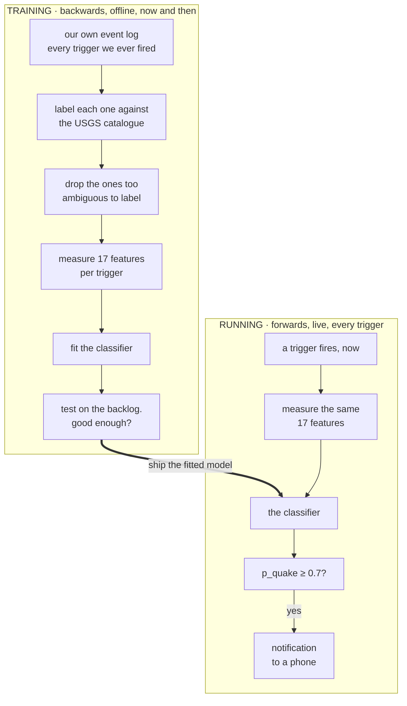
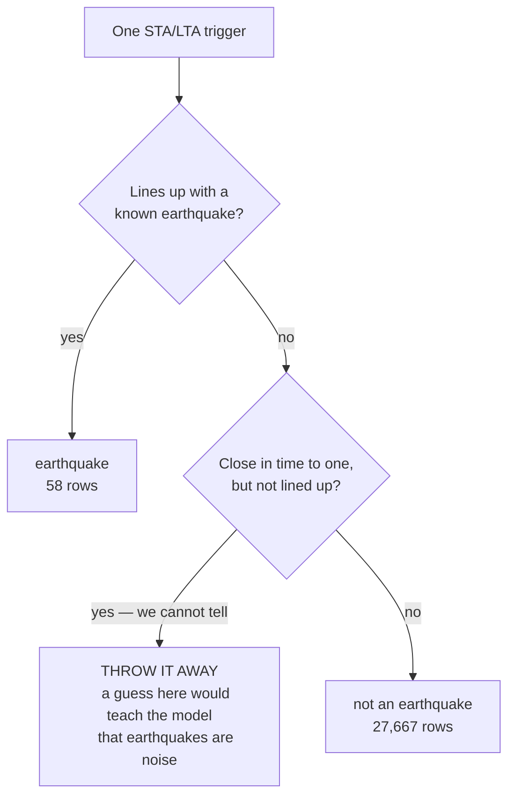
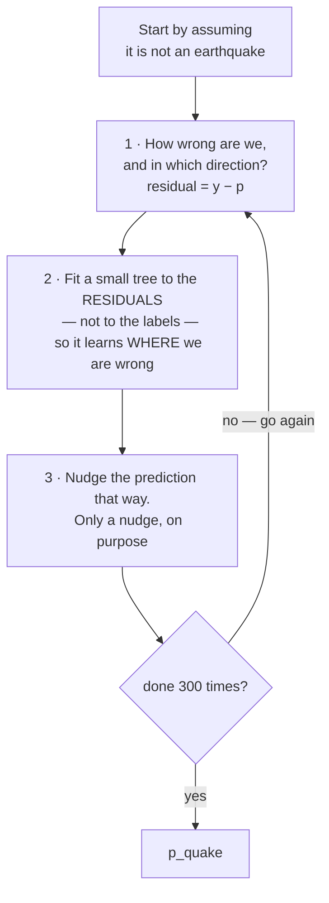

# The trigger classifier

*How this station decides whether it just felt an earthquake — written for someone who
can program and has met a little probability, but has never touched seismology.*

The short version: an earthquake detector that reacts to "the ground got suddenly
louder" reacts mostly to cars. Deciding which of its alarms are real is a **binary
classification problem**, and this document is about solving it honestly with a
frustratingly small number of examples.

---

## 1. Why there is a problem at all

The classical seismic detector is **STA/LTA**: short-term average over long-term
average. You keep two running averages of the signal's amplitude — a short window
(about a second) and a long one (about a minute) — and you divide one by the other.
When the ratio crosses a threshold, something just got much louder than the recent
background, and you call that a **trigger**.

It is a beautiful algorithm. It is fifty years old, it needs almost no CPU, it adapts
automatically as background noise changes through the day, and it makes no assumptions
about what an earthquake looks like.

That last property is also the problem. **STA/LTA does not detect earthquakes. It
detects things getting louder.** In a residential garage in California, the things that
get louder are, in rough order of frequency: cars on the road 92 m away, the garage
door, footsteps, doors closing elsewhere in the house, and the heat-pump compressor
cycling on.

The numbers are brutal. This station logs roughly **20,000 triggers a month**. The
ground actually moves — a real catalogued earthquake within our ~89 km reach — about
**five times a week**.

So the detector's raw output is about 99.8% noise, and we need a second stage.

## 2. What we are trying to do, and the shape of the whole thing

**The goal is to know that an earthquake has happened within seconds of it happening,
without waiting for anyone else to tell us.** That single sentence explains every choice
in this document, so it is worth stating before the machinery.

The USGS catalogue is authoritative, and it is also *late*: an automatic solution appears
in minutes and a reviewed one can take days. If all we wanted was a list of local
earthquakes, there would be nothing to build — you download it. What a station of your
own gives you is the answer **now**, from your own ground, which means the decision
*"was that an earthquake?"* has to be made here, unaided, at the moment the shaking
arrives.

So the catalogue is what we learn **from**, not what we wait **for**. That inversion is
the whole design: we spend the catalogue once, offline, to teach a model what an
earthquake looks like in our own data — and after that the live path never consults it
again.

We keep STA/LTA as the detector and **learn to believe it less**.

That framing is not original here — it is taken directly from how the USGS National
Earthquake Information Center runs its own pipeline, described in **Yeck et al.
(2020)**[^yeck]. The instinct on first meeting this problem is to replace STA/LTA with
something cleverer. NEIC does not. It keeps the fifty-year-old detector, which is fast,
adaptive and assumption-free, and bolts learned classifiers on *afterwards* to judge what
it produced. Their reported win was about **25 % fewer false associations — not more
detections**. That is the whole idea this station borrowed, four orders of magnitude
down: the cheap detector stays, and a model is trained to disbelieve it.

[^yeck]: Yeck, W. L., Patton, J. M., Ross, Z. E., Hayes, G. P., Guy, M. R., Ambruz,
    N. B., Shelly, D. R., Benz, H. M., & Earle, P. S. (2020). *Leveraging Deep Learning
    in Global 24/7 Real-Time Earthquake Monitoring at the National Earthquake Information
    Center.* **Seismological Research Letters, 92**(1), 469–480.
    [doi:10.1785/0220200178](https://doi.org/10.1785/0220200178) — published online
    23 September 2020, in the January 2021 issue.

### The pipeline, end to end

Two halves. The thing to hold on to is that **they run in opposite directions in time.**

**Training — backwards, offline, on the Mac, occasionally.**

1. Take our own event log: every STA/LTA trigger this station has ever fired.
2. **Label** each one — did it line up with an earthquake the USGS catalogue confirms?
3. **Drop** the ones too ambiguous to label honestly (§ below — this matters more than
   it sounds).
4. **Measure features**: seventeen numbers describing the shape of each trigger.
5. **Fit** a classifier to predict the label from the features — with some
   synthetic weak positives mixed in, because real ones are desperately scarce (§6).
6. **Test** it against the backlog, and against the hand-written rule it replaces.
7. If it is good enough, **deploy** it to the Pi 5.

**Running — forwards, live, on the Pi 5, every time a trigger fires.**

A trigger fires → measure *the same seventeen features* → the model returns `p_quake` →
at ≥ 0.7 a notification goes to a phone. No catalogue, no network, no waiting.



Notice what is *not* in the lower half: the catalogue. Once the model is fitted, the live
path is self-contained — which is the point, because the catalogue is the thing we are
trying to beat to the answer.

Everything from §3 onward is detail on one of those steps.

### What a row is

- **One row** = one trigger. Not one earthquake, one *trigger* — a single earthquake
  usually fires several, as P waves, then S waves, then coda arrive.
- **The window** = 5 seconds before the trigger to 25 seconds after, from the 100 sps
  archive. The 5 seconds of lead-in matters: it is the only measurement of what the
  background looked like immediately beforehand.
- **The label** = 1 if this trigger lines up with a real earthquake, 0 otherwise.

### Where labels come from, and the trap in them

The labels come from the **USGS/NCEDC catalogue** — the professional network's list of
what actually happened, which is as close to ground truth as a hobbyist gets. A trigger
is labelled 1 if it starts within −3 to +40 seconds of the predicted P-wave arrival for
a confirmed catalogue event.

The subtle part is the third category. Consider a trigger 90 seconds after a real M4.2.
Is it an aftershock (label 1) or a truck (label 0)? We genuinely do not know: small
aftershocks are below the catalogue's own detection threshold, so its silence is not
evidence of absence. **Labelling those 0 would teach the model that earthquakes are
cultural noise.** So any trigger within ±180 s of *any* known event is **dropped as
ambiguous** rather than guessed at. The busy hours after the Cloverdale mainshock are
mostly excluded from training on purpose.



The middle branch is the one to look at. It would be so easy to let it fall through to
0 — it is only an `else` — and the dataset would look bigger and cleaner and be quietly
poisoned.

A rule worth internalising: **when you cannot label an example honestly, deleting it
beats guessing.** A wrong label is worse than no label, because the model has no way to
know it is wrong and will faithfully learn it.

## 3. The features

Seventeen numbers per trigger, defined once in `server/trigger_features.py`. They fall
into three groups, and each is trying to capture something physical:

**Where the energy sits in frequency.** Five band-power fractions (1–3, 3–8, 8–15,
15–30, 30–45 Hz), the ratio of high-band to low-band energy, the spectral centroid, and
the dominant frequency. This is the workhorse group, because an earthquake and a car
genuinely differ here: a car is a broadband, high-frequency scrape, while an earthquake
that has travelled tens of kilometres through rock has had its high frequencies
absorbed along the way and arrives comparatively bass-heavy.

**What the shape looks like in time.** Rise time to the peak, decay time, duration above
three times the noise floor, where in the window the peak falls, and the signal-to-noise
ratio of the envelope. An earthquake has a characteristic attack and a long ringing
coda; a door slam is a spike that stops.

**Statistical shape.** Kurtosis — roughly, how spiky the waveform is versus how
Gaussian.

### The one non-obvious design decision

**Absolute amplitudes are computed, stored for inspection, and then deliberately
withheld from the model.** Only ratios, fractions and shapes are fed in.

Why: the analogue front end was rebuilt on 2026-08-07, which changed the volts-per-unit-
of-ground-motion. If the model could see raw amplitude, it would quietly learn *"loud
events happened before August"* — a fact about this project's hardware history, not
about the ground. The moment the hardware changed again, that knowledge would become
actively wrong.

This is a general lesson about leakage. A feature does not have to be obviously
cheating to be useless; it only has to correlate with the answer *for reasons that will
not survive deployment*.

## 4. The model: gradient-boosted decision trees

This is the part worth slowing down on, because the choice of model class is doing more
work here than any hyperparameter.

### Start with one tree

A **decision tree** is a flowchart of yes/no tests on one feature at a time — *"is the
1–3 Hz energy fraction above 0.41?"* — with a number at each leaf. Training is greedy:
at each node, try every feature and every threshold, and keep the split that best
separates the classes by some impurity measure. Recurse. Stop at a depth limit.

Two properties matter for us. Splits are **axis-aligned** (each test looks at a single
feature), so nothing needs to be on a comparable scale — a feature in microvolts and a
feature that is a dimensionless fraction coexist without normalisation. And the tree is
**piecewise constant**: it carves the feature space into boxes and predicts one value per
box.

A single shallow tree is a weak model. It is also high-variance — shift a few training
points and the greedy first split can flip, changing everything beneath it.

### Two ways to combine trees, and why the difference matters

If you sort-of remember random forests: those are **bagging**. Train many deep trees
*in parallel* on bootstrap samples with random feature subsets, then average. Averaging
independent noisy estimates cancels noise, so bagging attacks **variance**. Each tree is
individually overfit; the ensemble is not.

**Boosting** is the other direction. Trees are built *in sequence*, each one trained to
fix what the ensemble so far still gets wrong. Every tree is deliberately too weak to
overfit on its own — here, depth 3 — and the ensemble improves by accumulating
corrections. Boosting attacks **bias**: it builds a complex function out of many
deliberately simple pieces.

For a small, noisy, heavily imbalanced dataset, the sequential version wins, because it
lets you control model complexity directly. You choose how much structure the model is
allowed to express, rather than growing full-depth trees and hoping averaging saves you.

### What the "gradient" means

Here is the mechanism, and it is more elegant than the name suggests.

The model predicts in **log-odds**, not probability: a running score `F(x)` that a
sigmoid converts to `p = 1/(1+e^-F)`. Start with `F₀` at the base rate of the data — for
us, log-odds of 0.21%, i.e. "almost certainly not an earthquake" before looking at
anything.

Now, at each round, ask: *which direction should each prediction move to most reduce the
loss?* For binary classification with log-loss, the negative gradient of the loss with
respect to `F` works out to something remarkably simple:

```
    residual = y − p
```

The **label minus the current predicted probability**. If a real earthquake is currently
scored 0.3, its residual is +0.7: push up, hard. If it is already scored 0.95, its
residual is +0.05: nearly satisfied, leave it alone. Cultural noise scored 0.02 has
residual −0.02 and is essentially finished.

So each round:

1. Compute every row's residual under the current model.
2. **Fit a small regression tree to the residuals** — not to the labels. This tree's job
   is to identify *regions of feature space where the model is currently wrong, and in
   which direction*.
3. Add it to the running score, scaled down by the learning rate: `F ← F + ν·h(x)`.



Follow one earthquake through the loop. Suppose it is currently scored `p = 0.3`. Its
residual is `+0.7`: the next tree is strongly pulled toward finding whatever region of
feature space that row sits in and pushing it up. Once it reaches `p = 0.95` its residual
is `+0.05` and it stops asking for attention, so later trees spend their capacity
elsewhere. Cultural noise already at `0.02` was never a problem and is ignored throughout.

The ensemble is a sum of small corrections, and the process automatically concentrates
its attention on the examples it is still getting wrong. That is the entire algorithm,
and "gradient" is just the observation that residuals *are* the gradient for this loss —
which is what lets the same machinery swap in a different loss function without changing
anything else.

### Why the small steps

The learning rate here is **0.05**, with **300** iterations. You could take full steps
and need far fewer trees; it would fit the training data faster and generalise worse.

Shrinkage means no single tree can dominate. A structure has to be re-derived by many
trees in a row before it becomes strong in the ensemble, so a pattern supported by three
lucky training rows never accumulates much weight, while a pattern present throughout
the data gets reinforced every round. **Small steps make the ensemble a democracy of
evidence rather than a sequence of overreactions** — which is exactly what you want when
you have 58 positive examples and cannot afford to chase any of them.

`max_depth=3` is the other lever: no tree can express an interaction between more than
three features. With this much data, that ceiling is protection, not a limitation.

Two more constraints are doing quiet work. **`min_samples_leaf=20`** forbids any leaf
holding fewer than 20 training samples — against 58 real positives, that is a strong
statement that the model may not carve out a special case for a handful of events.
**`l2_regularization=1.0`** shrinks the leaf values themselves toward zero, so even a
confident-looking region cannot contribute an unbounded jump in log-odds.

The class imbalance is handled by passing **per-sample weights** at fit time, up-weighting
the rare positives so 27,667 negatives cannot simply drown them out. (Not scikit-learn's
`class_weight` parameter — the weights are computed explicitly and passed to `fit`, which
also allows augmented rows to be weighted separately from real ones.)

### Why this model class suits *this* problem

**The data is tabular and already engineered.** The heavy lifting — turning 3,000 raw
samples into 17 physically meaningful numbers — is done by DSP in
`trigger_features.py`, not learned. Deep learning earns its keep when it discovers
representations from raw signals, and with 30 events there is no chance of that. Given
good hand-built features on a table, boosted trees are the method to beat, and usually
are not beaten.

**The decision boundary is genuinely non-monotonic, so linear models are out.** A
spectral centroid around 5–8 Hz is earthquake-like; both much lower (a door thump) and
much higher (a car scraping grit) are not. "Middle values are good" is a shape logistic
regression fundamentally cannot express without you hand-building the right basis
functions. A tree splits it twice and moves on.

**The signal lives in interactions.** Bass-heavy alone is not diagnostic — a passing
truck rumbles too. Bass-heavy *and* lasting eight seconds *and* rising in under a second
is diagnostic. Trees represent conjunctions natively: that is literally what a
root-to-leaf path is.

**Practical mess is handled for free.** Features on wildly different scales need no
normalisation. Outliers get isolated in their own leaf instead of dragging a fitted
coefficient around. And missing values are handled natively rather than imputed — some
older triggers have no `hf_lf` recorded, and the histogram-based implementation learns a
*default direction* for missing values at each split, which is a real answer rather than
a guess dressed as a mean.

**It outputs a probability we can threshold.** `p_quake` is a number we can slide against
the precision/recall trade-off, which a bare decision boundary would not give us.

**It stays inspectable.** Permutation importance tells us which features carry the
decision, so when the model disagrees with the old hand-written rule we can go and look
at why. On a project whose point is understanding the instrument, a model you cannot
interrogate would be a worse tool even if it scored higher.

*(The specific implementation is scikit-learn's `HistGradientBoostingClassifier`, which
bins each feature into at most 256 buckets up front so split-finding is a histogram scan
rather than a sort. That is a speed optimisation, but the binning also acts as mild
regularisation — the model cannot split between two nearly identical values.)*

### And the honest limitations

**Trees cannot extrapolate.** A tree is constant outside the range it was trained on, so
an earthquake far larger than anything in our archive gets the same score as one merely
at the top of it. For a detector this is tolerable — huge events are unmistakable by
every other measure — but it is a real property, not a detail, and it is the opposite of
what a linear model would do.

**The probabilities are not truly calibrated.** Boosting with log-loss produces
reasonable-looking probabilities, but `p = 0.7` does not mean "70% of triggers scored
this way are earthquakes". With 58 positives there is not enough data to calibrate
properly. The threshold is chosen from the measured precision/recall table, not from
believing the number.

**Sample weighting is a blunt instrument.** Up-weighting the positives makes the model
care about the rare class, and simultaneously distorts the output probabilities away from
the true base rate — the model is fitted as if earthquakes were far more common than they
are. Another reason to treat `p_quake` as a ranking score rather than a literal
likelihood.

## 5. Evaluation, which is where most of the difficulty actually is

### Accuracy is a useless metric here, and it is worth seeing why

Of 27,725 real triggers, **58 are earthquakes**. That is a base rate of **0.21%**.

A model that returns "not an earthquake" unconditionally, always, with no features and
no thinking, scores **99.79% accuracy**. It is also completely worthless. Any time you
see a headline accuracy figure on rare-event data, this is the first thing to check.

### Precision and recall

- **Precision** = of the triggers we flagged, what fraction were real? *(Low precision =
  your phone buzzes at trucks.)*
- **Recall** = of the real earthquakes, what fraction did we flag? *(Low recall = you
  sleep through it.)*

You trade one against the other by moving the decision threshold, and the right trade
depends entirely on what happens next. Here, a flagged trigger sends a phone
notification, so a false positive is mildly annoying and a false negative is a missed
earthquake.

### PR-AUC, and why not ROC-AUC

Summarise the whole precision/recall trade-off in one number by taking the area under
the precision-recall curve: **PR-AUC**. The crucial property is that a random model
scores the base rate — here 0.0021 — not 0.5.

You will more often meet **ROC-AUC**. Under heavy class imbalance it is misleading,
because its x-axis is the false-positive *rate*, and when negatives outnumber positives
478 to 1, thousands of false positives still look like a tiny rate. This project
supplies a textbook illustration of the gap:

| | ROC-AUC | PR-AUC |
|---|---|---|
| all triggers | 0.841 | **0.480** |
| the strong-signal slice | 0.999 | **0.882** |

A ROC-AUC of 0.999 sounds like a solved problem. The PR-AUC of 0.882 on the same rows
is the honest number, and even that is 140× the base rate rather than 99.9% of anything.

### Cross-validation has to be *grouped*

The standard move is k-fold cross-validation: split the rows into k parts, train on
k−1, test on the held-out one, rotate.

Splitting **randomly** would be wrong here, in a way that is easy to miss and would
inflate every number in this document. One earthquake produces several triggers — P, S,
coda — and they look extremely alike. A random split puts some of an event's triggers in
train and others in test, so the model is effectively tested on rows it has already
seen. Worse, aftershocks resemble their own mainshock, so an aftershock in the test set
can be "predicted" by having memorised the mainshock.

So the splits are **grouped** — five folds of `StratifiedGroupKFold`, with positives
grouped by catalogue event and negatives grouped by day. An event is wholly in train or wholly in test, never split across both. This
lowers the reported scores, which is the point — the lower number is the true one.

## 6. The rare-positive problem, and what augmentation actually buys

Fifty-eight positive rows is not many, and the shortage is not fixable by working
harder: it is set by how often the ground moves, which is about five times a week.

`analysis/augment.py` takes known earthquakes and buries them in progressively more real
archive noise, producing 792 additional positive rows.

**Be precise about what this does and does not do.** It multiplies the *sample count*,
not the *information*. There are still only 30 independent earthquakes in there
afterwards; augmentation cannot conjure a 31st. What it does buy is the **decision
boundary**. The class the model is worst at is the weak, marginal, barely-triggering
earthquake, and the catalogue supplies only a handful. Synthesising them by adding noise
to strong events populates exactly that region.

Two rules make this honest, and they are the whole reason it is defensible:

- Augmented rows are **train-only**. They never appear in a test fold.
- **Every reported metric is computed on real rows.** A PR-AUC that counted synthetic
  positives would be measuring our noise generator, not the station.

## 7. The confession about leakage

There is a form of overfitting that cross-validation cannot detect, and this project has
it.

Grouped CV is honest about leakage *between folds*. It is silent about the many times a
human looked at these same rows and then chose a feature, a threshold, or a filter. Do
that often enough and the whole dataset has informed the model's design, even though no
single fit ever saw its own test set. The measured scores drift optimistic and nothing
in the pipeline complains.

So on **2026-08-30** a **held-out set was frozen**: every trigger after 2026-08-31 is
reserved, never fitted, only scored. It cost nothing to start — there was no data after
that date yet — and it is the one thing that cannot be arranged retroactively. You
cannot un-see data.

The comment in `trigger_train.py` is worth quoting in full, because it is the actual
safeguard: *move this date forward ONLY by deliberately promoting the holdout into
training and choosing a new one; never to make a number look better.*

## 8. How well does it work?

Against the hand-written rule it replaced (`hf_lf < 1.4`, meaning "bass-heavy, therefore
seismic"):

| | precision | recall |
|---|---|---|
| the old rule, all triggers | 0.088 | 0.797 |
| the model at p ≥ 0.7 | **0.206** | 0.55 |
| the old rule, strong-signal slice | 0.026 | 1.000 |
| the model at p ≥ 0.7, that slice | **0.417** | 0.91 |

On the slice that actually reaches a human, the model is **16× more precise than the
rule** at comparable recall — 48 flags instead of 465 to catch the same earthquakes.
The deployment threshold is **p ≥ 0.7**, and triggers below a peak-to-noise ratio of 10
are not scored at all: that region is 20,000 blips a month, and a model trained there
learns to predict blips (PR-AUC 0.06).

## 9. What it gets wrong, which is the interesting part

The training script prints every real earthquake ranked by its out-of-fold score, so the
failures are visible rather than averaged away. The misses share an obvious pattern:

```
p=0.00  M2.17  2 km NE of The Geysers      38.7 km   ratio=4.31
p=0.00  M1.69  5 km W of Glen Ellen        10.2 km   ratio=11.27
p=0.04  M3.2   6 km NW of The Geysers      43.5 km   ratio=7.24
p=0.02  M1.82  6 km W of Cobb              44.7 km   ratio=4.53
```

Nearly every bad miss is **far away and weak** — The Geysers, Cobb, 38–45 km out, with
trigger ratios of 4 to 12 against a strong event's several hundred. By the time that
energy has crossed 40 km of Sonoma County it genuinely does look like a truck, and the
model is not wrong to be unsure so much as out of evidence.

Note the M3.2 scoring **0.04**. That is a decent-sized earthquake, missed. It is in this
document rather than omitted from it because a classifier's failure modes are more
informative than its headline score, and because a station that only ever published its
successes would not be worth reading.

Note also the Glen Ellen M1.69 appearing at p=0.00 *and*, from a different trigger of
the same event, at p=0.86. Rows are triggers, not earthquakes. One arrival can be
unmistakable while another from the same quake is invisible.

## 10. Getting it into production without it rotting

One failure mode kills more deployed models than any modelling mistake: **training/
serving skew**, where the features computed at training time and the features computed
at inference time drift apart, and the model is quietly fed something it was never
fitted on.

The defence here is structural rather than procedural. `server/trigger_features.py`
contains **one** definition of the feature vector, imported by both the trainer (on the
Mac) and the live detector (on the Pi 5). There is no second implementation to fall out
of step. The saved model carries its own feature list and ratio floor in the joblib
bundle, so the scorer reads columns by name in the order the model expects. Neither
Raspberry Pi ever trains anything.

---

## 11. What transfers from the professionals, and what does not

Since this station copied its architecture from Yeck et al., it is worth being explicit
about which parts of a national-scale system survive the drop to one sensor in a garage —
because the answer is not "all of them", and the differences are the interesting part.

**The framework transfers.** STA/LTA feeding a learned discriminator works at *tens* of
positives, which is genuinely surprising and is the single most useful thing this project
has confirmed for anyone else at hobby scale. You do not need a national network to make
the second stage pay for itself.

**The architecture does not.** NEIC learns filters directly from raw waveforms, which is
what a training set of ~1.3 million analyst-reviewed arrivals buys you. With 30 events,
representation learning is not on the table, and hand-engineered features are the
substitute — which is why so much of this document is about DSP rather than about
networks. Deep learning is not being avoided out of taste; it is being avoided because
the data does not exist.

**Two problems are ours and not theirs:**

- **Hardware churn.** A hobby station gets rebuilt: this one's front end changed on
  2026-08-07. NEIC's instruments do not change under it mid-catalogue. That is why every
  feature here is amplitude-*relative* and why the project keeps a formal epoch table
  (`analysis/epochs.py`), so a fit can never silently straddle a rebuild.
- **Grouped cross-validation is mandatory at small N.** Positives arrive in clusters —
  mainshock plus aftershocks, Geysers sequences — so ungrouped folds let an aftershock
  vouch for its own mainshock. At 1.3 million samples that leakage is diluted to
  nothing; at 58 it dominates.

There is a longer write-up of this deferred in `BACKLOG.md`, framed as a medical-style
**case report** — not novel research, but an honest account of how far the original work
carries into a much more modest setting. It is deliberately waiting for more positives,
because the before/after currently rests on a handful of events.

---

## Further reading

Everything above is a compressed version of ideas other people explain better and at
greater length. These are the ones actually worth your time, with what each is good
*for* — not a bibliography.

**STA/LTA and seismic triggering**

- Trnkoczy, *[Understanding and parameter setting of STA/LTA trigger
  algorithm](https://gfzpublic.gfz.de/pubman/item/item_43337_3/component/file_56122/IS_8.1_rev1.pdf)*
  (IASPEI New Manual of Seismological Observatory Practice, IS 8.1,
  doi:10.2312/GFZ.NMSOP_r1_IS_8.1). Twenty pages, free, and the standard practical
  reference. If you only read one thing about *why* the windows are the lengths they are,
  read this.
- ObsPy's [trigger/picker tutorial](https://docs.obspy.org/tutorial/code_snippets/trigger_tutorial.html)
  — runnable code with plots. The fastest way to get a feel for STA/LTA is to move the
  threshold yourself and watch what it catches.

**Decision trees and gradient boosting**

- Parr & Howard, *[How to explain gradient boosting](https://explained.ai/gradient-boosting/)*.
  **Start here.** Three articles that build the algorithm up visually from "fit a tree to
  the residuals", including a careful treatment of the one question everyone stumbles on —
  in what sense this is gradient descent, and descent through *what* space.
- StatQuest, *[Gradient Boost Part 1: Regression Main
  Ideas](https://www.youtube.com/watch?v=3CC4N4z3GJc)* (four parts, ~15 min each). If you
  prefer being talked through it on a whiteboard, this is the clearest version anywhere,
  and parts 3–4 cover the classification case that this project actually uses.
- scikit-learn's [ensembles user guide](https://scikit-learn.org/stable/modules/ensemble.html)
  — the reference for what the knobs in our code do, including the histogram-based
  implementation and its native handling of missing values.
- Friedman (2001), *[Greedy Function Approximation: A Gradient Boosting
  Machine](https://projecteuclid.org/journals/annals-of-statistics/volume-29/issue-5/Greedy-function-approximation-A-gradient-boosting-machine/10.1214/aos/1013203451.full)*,
  Annals of Statistics 29(5). The original. Read it after one of the two above, not
  before.
- James, Witten, Hastie & Tibshirani, *[An Introduction to Statistical
  Learning](https://www.statlearning.com/)* — free PDF, and pitched at exactly the level
  of this document. Chapter 8 is trees, bagging, random forests and boosting in about
  thirty readable pages. Its heavier sibling, *[The Elements of Statistical
  Learning](https://hastie.su.domains/ElemStatLearn/)*, is also free and goes much deeper
  into why shrinkage works.

**Evaluating a classifier when the positives are rare**

- Saito & Rehmsmeier (2015), *[The Precision-Recall Plot Is More Informative than the ROC
  Plot When Evaluating Binary Classifiers on Imbalanced
  Datasets](https://journals.plos.org/plosone/article?id=10.1371/journal.pone.0118432)*,
  PLOS ONE 10(3): e0118432. This is the paper behind §5. If the ROC-AUC 0.999 versus
  PR-AUC 0.882 gap in this document surprised you, it explains exactly why that happens.
- scikit-learn's [precision-recall
  example](https://scikit-learn.org/stable/auto_examples/model_selection/plot_precision_recall.html)
  — short, with the code to reproduce the curves on your own data.

**Cross-validation and leakage**

- scikit-learn's [cross-validation user
  guide](https://scikit-learn.org/stable/modules/cross_validation.html). Read the section
  on **grouped** splitters; it is the machinery behind §5 and the reason an aftershock
  cannot vouch for its own mainshock here.
- Kaufman, Rosset & Perlich (2011), *[Leakage in Data Mining: Formulation, Detection, and
  Avoidance](https://www.cs.umb.edu/~ding/history/470_670_fall_2011/papers/cs670_Tran_PreferredPaper_LeakingInDataMining.pdf)*
  (KDD). The catalogue of ways information sneaks from test into train. §7's confession —
  that a human repeatedly looking at the same rows leaks too, and no cross-validation
  scheme can catch it — is this problem in its hardest-to-see form.

---

## Where the code lives

| file | what it does |
|---|---|
| `server/trigger_features.py` | the feature vector, and the scorer. The single source of truth |
| `analysis/harvest_events.py` | pulls catalogue events and matches them to the archive |
| `analysis/trigger_dataset.py` | every trigger → a labelled feature row |
| `analysis/augment.py` | synthetic weak positives, train-only |
| `analysis/trigger_train.py` | fits, evaluates, saves the model |
| `server/detector.py` | scores live triggers, pushes at p ≥ 0.7 |

Numbers in this document are from a training run on 2026-09-04 and will move as the
archive grows. Rerun `analysis/trigger_train.py --aug` to reproduce all of them.
