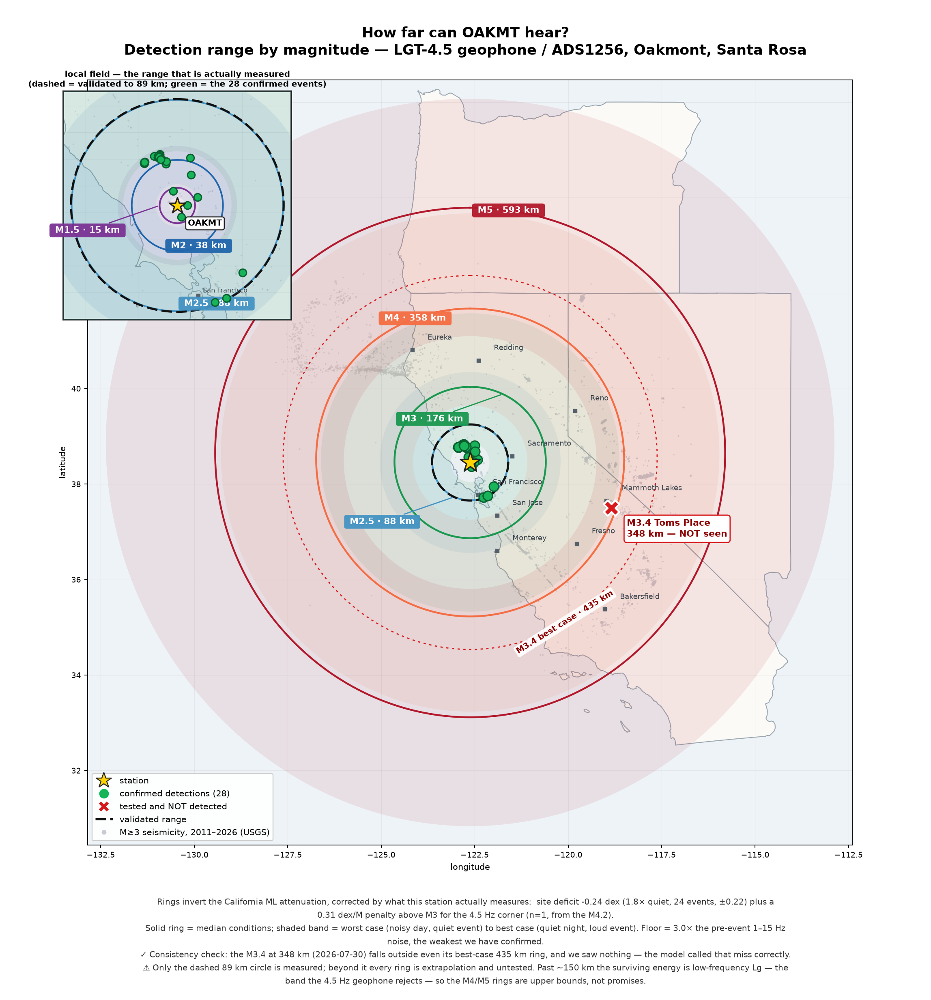
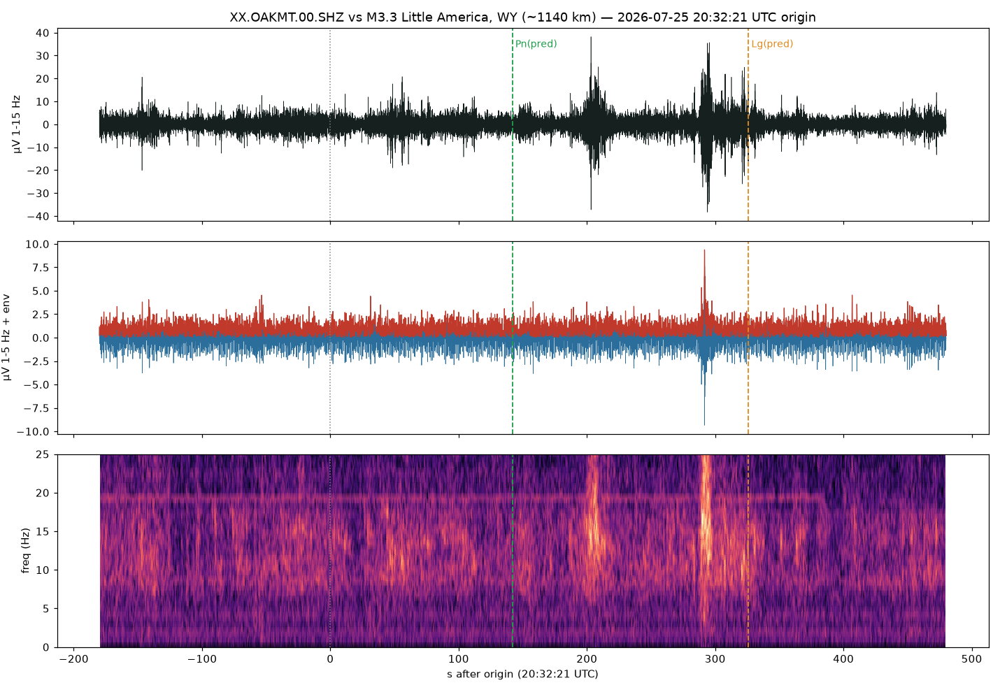
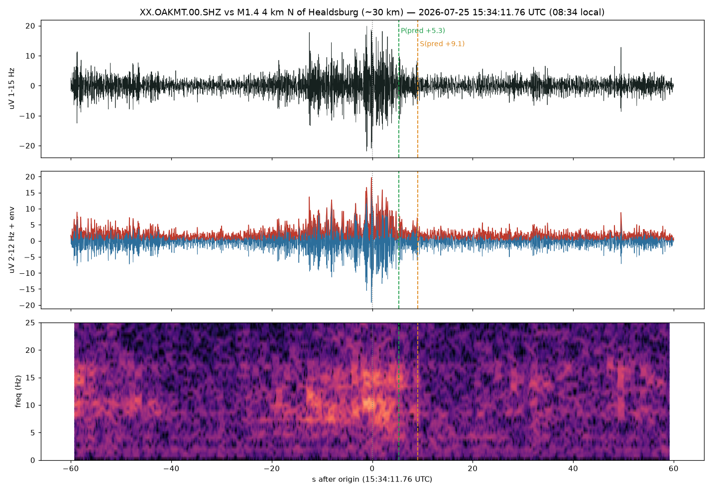

# reports — cataloged station examples

Curated, share-worthy examples of what the station has recorded. Images are
generated from the archive by [`analysis/quake_share.py`](../analysis/quake_share.py)
(see its docstring) and can be regenerated any time from the miniSEED day-files.

**Naming:** report images use **descriptive** names. The tool's default output
name is `eq_*.png`, which is gitignored (scratch outputs) — so a curated example
kept here gets a descriptive name and is committed.

**What does NOT belong here.** Working comparisons — the three renders behind a
choice of colour axis, the two spectrogram parameter sweeps — are not reports, even
though they are pictures and they came from the archive. The *decision* those images
informed belongs in the code that implements it (`analysis/specgram.py`'s colour-axis
note, `dashboard/HELICORDER.md`), where the next person will actually meet it; the
renders themselves are scratch. `reports/heli-*.png`, `reports/spec-pw/` and
`reports/spec65/` are gitignored for that reason. If a comparison is worth keeping,
give it a descriptive name and a paragraph here saying what it settled.

**Audio.** Not every artefact is an image. `audible-m3.5-larkfield-*.wav` are
real-time clips of the M3.5 that people around Santa Rosa actually *heard* — see
[`analysis/audible.py`](../analysis/audible.py) and the write-up at
[/how/classifier](https://seismo.mcguinness.ai)'s sibling page. They are 20–50 Hz and
need a subwoofer or over-ear headphones; laptop speakers reproduce none of it.

## Detection range map



`analysis/detection_map.py`, calibrated from `analysis/event_harvest.csv`. Refreshed
2026-08-26 from a re-harvest through 08-26: **28 confirmed events, validated to 89 km**
(the M3.8 San Leandro), site deficit −0.24 dex. Re-run the harvester and then the map
whenever new catches land; the public **Catches** page (`dashboard/catches/`) carries
the same render plus per-event share images made with `quake_share.py`.

## Earthquakes

### 2026-07-25 — M2.5, 3 km E of St. Helena, CA · **first confirmed event**


- **USGS:** M2.5, 2026-07-25 11:31:41.760 UTC, 38.507°N 122.435°W, depth 6.2 km —
  ~19 km from Oakmont, on the Maacama/Rodgers Creek system. (Magnitude, location,
  depth, origin time are the catalog's, not ours.)
- **What we measured:** a clean impulsive local event — sharp **first arrival (P) at
  +3.97 s** (11:31:45.73), matching the catalog-predicted P time (~+3.3 s) within our
  clock + velocity-model slop; **peak ~117 µV** against a ~1.4 µV noise floor
  (**SNR ~85×**), ~25 s coda. STA/LTA fired with ratio 645 (every prior trigger a
  false positive under 60).
- **What we can NOT do from one trace:** the **S** is buried — for a close event P
  and S are only ~2.4 s apart and merge into one burst, so S sits in the coda, not
  separately pickable. Therefore **no independent single-station S–P or distance** —
  the ~19 km is the catalog's. (Earlier drafts drew a P near the noise floor and an
  "S–P → distance confirms the catalog" annotation; that was circular and is gone.
  A candidate spike at +2 s implies a ~10 km/s P velocity — too fast for a direct P —
  so it's noise, not the P.)
- **What actually confirms it's an earthquake:** other stations saw it. Nearby
  professionals recorded it too — **BK.CMB** (broadband, ~185 km) and **CE.68327**
  Santa Rosa (Kinemetrics EpiSensor strong-motion) — and their multi-station picks
  are what locate and confirm the event. A single geophone detects; a network confirms.
- Regenerate:
  ```
  analysis/.venv/bin/python analysis/quake_share.py \
    --mseed <XX.OAKMT.00.SHZ.D.2026.206.mseed> \
    --usgs-near 2026-07-25T11:31:45 \
    --p 3.97 --expect-s --spectrogram --out reports/2026-07-25-m2.5-st-helena.png
  # --usgs-near <time> (~the trigger time) auto-fills mag/place/lat/lon/depth/origin from
  # the USGS catalog -- no event id, no site lookup. A no-match => probably cultural noise.
    # envelope is on by default; --spectrogram stacks the time-frequency panel below (one image)
  ```

## Non-detections (the envelope's other edge)

### 2026-07-25 — M3.3, Little America, WY (~1140 km) · **not detected**



- A distant (~1140 km) M3.3. In the geophone band there is **no arrival** at the
  predicted regional times — Pn(pred) +142 s and Lg(pred) +326 s both sit at ~1×
  the pre-event noise (1-15 Hz: Pn 1.1×, Lg 1.4×; 1-5 Hz: 1.0×/1.0×). The two
  bright bursts near +205 s and +290 s are **local cultural noise**: impulsive,
  broadband to 25 Hz, and unaligned with either predicted phase. A source 1140 km
  away cannot deliver 15-25 Hz energy (high frequencies attenuate first), so
  broadband-impulsive is the signature of something local, not teleseismic.
- This is the useful counter-example to the St. Helena hit: it pins down the
  station's **local-only detection envelope**. Kept here so the two plots sit on the
  **same spectrogram colour ruler** (see below) and can be compared directly.

### 2026-07-25 — M1.4, 4 km N of Healdsburg, CA (~30 km) · **not detected**



- A *local* M1.4 (38.642°N 122.862°W, depth 6.9 km, 15:34:11.76 UTC) — ~30 km from
  Oakmont, so **not** a distance/frequency wall like Wyoming. This one is a raw
  **sensitivity/noise-floor** miss.
- No arrival rises at the predicted windows — P(+5.3 s), S(+9.1 s) — RMS in the
  signal window is ~1.1× the pre-event noise. The loudest burst sits at **t ≈ 0**,
  the origin instant, and peaks *before* +5.3 s — **physically impossible** for the
  quake (energy from 30 km away can't arrive before ~5 s), so it's a coincidental
  cultural-noise transient, not the event. The whole record is littered with
  identical impulsive bursts.
- **Why it's below threshold:** M1.4 vs the St. Helena M2.5 is ~1.1 mag units → ~13×
  less amplitude, plus 1.6× farther (30 vs 19 km) → predicted peak ~6–8 µV. And it
  struck at **08:34 local (Sat morning)**, so the daytime cultural-noise floor was up
  (~2.5 µV RMS vs the ~1.4 µV of the quiet St. Helena event). The quake never clears
  the grass. A M1.4 at 30 km is at the very edge of what this station could do, and it
  needed a quiet floor it didn't get.
- The lever for the next one is a quieter site or the 100 sps upgrade (both on the
  backlog) — **not** the environmental node, which addresses tilt/thermal artifacts,
  not the noise floor.

## Spectrogram standard

Every spectrogram in this repo is drawn by [`analysis/specgram.py`](../analysis/specgram.py)
so they share one absolute colour scale (magma, fixed **−25 .. +25 dB**, 1.5 s window /
0.2 s hop, 0–25 Hz, high-passed full-band µV). The fixed axis is the point: the same
colour is the same absolute power in every figure, so a real event and a non-detection
lie on one ruler. Don't hand-roll spectrograms elsewhere — import `specgram.draw()`.
