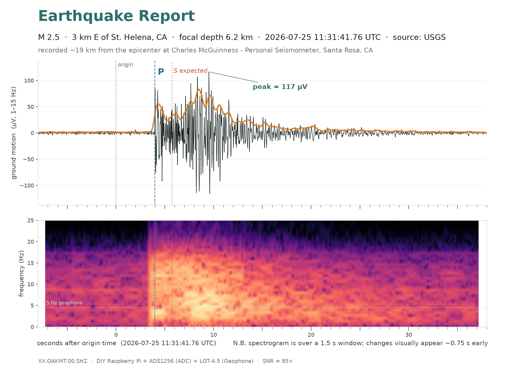

# reports — cataloged station examples

Curated, share-worthy examples of what the station has recorded. Images are
generated from the archive by [`analysis/quake_share.py`](../analysis/quake_share.py)
(see its docstring) and can be regenerated any time from the miniSEED day-files.

**Naming:** report images use **descriptive** names. The tool's default output
name is `eq_*.png`, which is gitignored (scratch outputs) — so a curated example
kept here gets a descriptive name and is committed.

## Earthquakes

### 2026-07-25 — M2.5, 3 km E of St. Helena, CA · **first confirmed event**



- **USGS:** M2.5, 2026-07-25 11:31:41.760 UTC, 38.507°N 122.435°W, depth 6.2 km —
  ~19 km from Oakmont, on the Maacama/Rodgers Creek system. (Magnitude, location,
  depth, origin time are the catalog's, not ours.)
- **What we measured:** a clean impulsive local event — sharp **first arrival (P) at
  +3.97 s** (11:31:45.73), matching the catalog-predicted P time (~+3.3 s) within our
  clock + velocity-model slop; **peak ~117 µV** against a ~1.4 µV noise floor
  (**SNR ~85×**), ~25 s coda. STA/LTA fired with ratio 645 (every prior trigger a
  false positive under 60).
- **What we can NOT do from one trace:** the **S** is buried — for a close event P
  and S are only ~2.4 s apart and merge into one burst, so S sits in the coda, not
  separately pickable. Therefore **no independent single-station S–P or distance** —
  the ~19 km is the catalog's. (Earlier drafts drew a P near the noise floor and an
  "S–P → distance confirms the catalog" annotation; that was circular and is gone.
  A candidate spike at +2 s implies a ~10 km/s P velocity — too fast for a direct P —
  so it's noise, not the P.)
- **What actually confirms it's an earthquake:** other stations saw it. Nearby
  professionals recorded it too — **BK.CMB** (broadband, ~185 km) and **CE.68327**
  Santa Rosa (Kinemetrics EpiSensor strong-motion) — and their multi-station picks
  are what locate and confirm the event. A single geophone detects; a network confirms.
- Regenerate:
  ```
  analysis/.venv/bin/python analysis/quake_share.py \
    --mseed <XX.OAKMT.00.SHZ.D.2026.206.mseed> \
    --usgs-near 2026-07-25T11:31:45 \
    --p 3.97 --expect-s --spectrogram --out reports/2026-07-25-m2.5-st-helena.png
  # --usgs-near <time> (~the trigger time) auto-fills mag/place/lat/lon/depth/origin from
  # the USGS catalog -- no event id, no site lookup. A no-match => probably cultural noise.
    # envelope is on by default; --spectrogram stacks the time-frequency panel below (one image)
  ```
